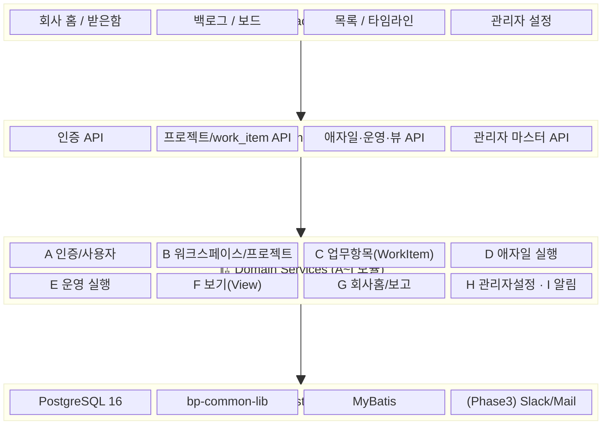
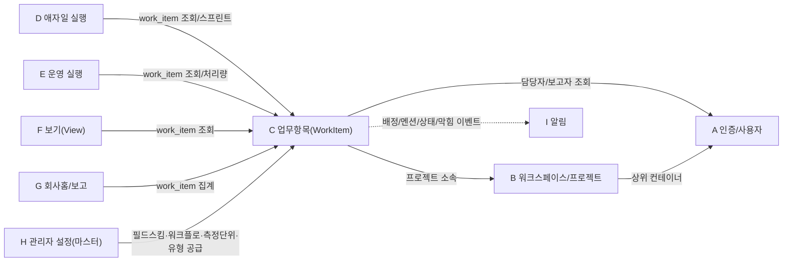

# WorkMap 모듈 요약 대시보드

> 설계 버전: 2.0 | 최종 수정: 2026-06-23 | 관련 CR: CR-006

> 프로젝트 전체 구조를 한눈에 파악. Sprint 계획 수립 시 참조.
> 프로젝트 유형: 풀스택 (Spring Boot + React)
> 원본: docs/T1-1_기능요구사항_명세서.md (기능 ID·모듈 정본) · docs/origins/WorkMap_제품기획서_v0.4_Jira기반.md

> 핵심 컨셉: **하나의 work_item 데이터, 여러 관점.** 백로그·보드·목록·타임라인·이슈는 work_item 단일 테이블의 파생 뷰다(별도 테이블 금지). work_item = Epic/Story/Task/Bug/Sub-task + issue_type + parent_id/epic_id 계층.

---

## 시스템 구조도

> 인프라: PostgreSQL 16 + MyBatis(WorkMap 결정, JPA 금지). 응답·예외·페이징·JWT·검색은 bp-common-lib 제공. 외부 알림(Slack/Mail)은 Phase 3.

---

## 모듈 의존 관계도

> 실선(→): 동기 호출 / 직접 의존 · 점선(-.->): 비동기 이벤트(도메인 이벤트 → 알림). WorkItem이 중심이며, 영역(area) 개념은 폐기되고 프로젝트 소속으로 대체. 관리자 설정(H)은 마스터 데이터(필드스킴·워크플로·측정단위·업무유형)를 work_item에 공급한다.

---

## 모듈 현황

> MVP = Phase 1 포함 여부(T1-1 우선순위 High = MVP). 기능 수는 T1-1 기능 요약 테이블과 일치.

| 모듈 | 기능 수 | MVP(Phase1) 포함 | 제외 | 책임 요약 | Sprint |
|------|--------|-----------------|------|----------|--------|
| A. 인증/사용자 | 5 | 5 | 0 | 로그인·토큰(JWT), 내 정보, 사용자 생성/초대/관리 | Sprint 1 |
| B. 워크스페이스/프로젝트 | 6 | 5 | 1 | 워크스페이스·프로젝트(유형 프리셋)·멤버·가시성 | Sprint 1~2 |
| C. 업무 항목(Work Item) | 16 | 15 | 1 | work_item 단일 테이블 CRUD·계층·담당·상태(FSM)·협업·이력·측정 추상화 | Sprint 2~3 |
| D. 애자일 실행 | 6 | 5 | 1 | 백로그·스프린트(시작/완료)·스크럼 보드·번다운 | Sprint 3~4 |
| E. 운영 실행 | 4 | 3 | 1 | 운영 칸반·처리량·현장이슈→개발 전환·현장검증 | Sprint 4 |
| F. 보기(View) | 4 | 2 | 2 | 목록(표/분할)·타임라인·캘린더·검색/필터 | Sprint 4 |
| G. 회사 홈/보고 | 3 | 3 | 0 | 막힘 중심 홈·지연/막힘/미배정 집계·프로젝트 보고서 | Sprint 5 |
| H. 관리자 설정 | 5 | 3 | 2 | 측정단위·필드스킴·워크플로·업무유형·양식빌더 (마스터, 하드코딩 금지) | Sprint 2, 5 |
| I. 알림 | 2 | 2 | 0 | 인앱 알림·받은함, 트리거 발행 | Sprint 5 |
| **합계** | **51** | **43** | **8** | | |

> 측정 추상화(WMP-WI-016 + 측정단위 마스터 WMP-ADM-001)는 **Phase 1 포함**. 관리자 마스터(측정단위·필드스킴·워크플로)는 work_item·FSM·필드 표시의 데이터 소스이므로 work_item과 함께 조기 구현한다.

---

## Phase ↔ Sprint 매핑

| Phase | 본 설계 Sprint | 범위 | 기능 |
|-------|---------------|------|------|
| **Phase 1 (MVP)** | Sprint 1~5 | 인증·워크스페이스/프로젝트·work_item(계층·CRUD·상태·측정)·백로그/스프린트/보드·운영 칸반/처리량·목록·검색·관리자 마스터·회사홈·알림 | High 표기 43개 |
| Phase 2 | Sprint 6+ | 번다운/번업·타임라인/로드맵·캘린더·현장검증·양식빌더·이슈 링크·저장필터·업무유형 관리 | Medium 8개 |
| Phase 3+ | 후속 | 채널 소통·자동화 룰·외부 알림(Slack/Mail)·이슈수준 보안·포트폴리오·AI(범위 밖) | Low |

> 본 설계 산출물은 **Phase 1(Sprint 1~5)을 구현 대상**으로 상세화하고, Phase 2~3+는 청사진으로 보존한다. 채널 소통(기획서 §13.7.2)·AI 기능은 본 명세 범위 밖.
