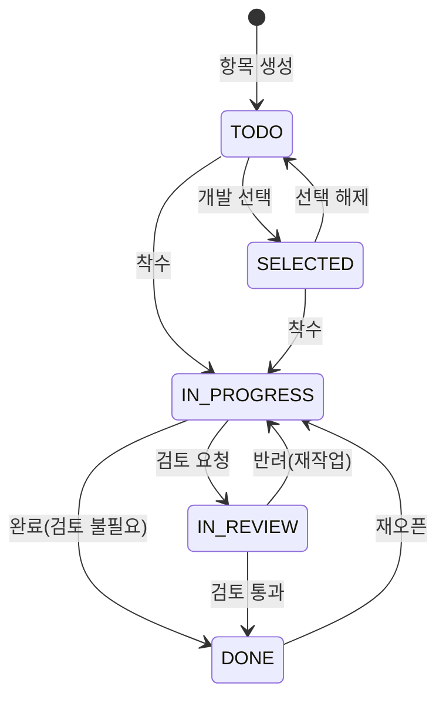
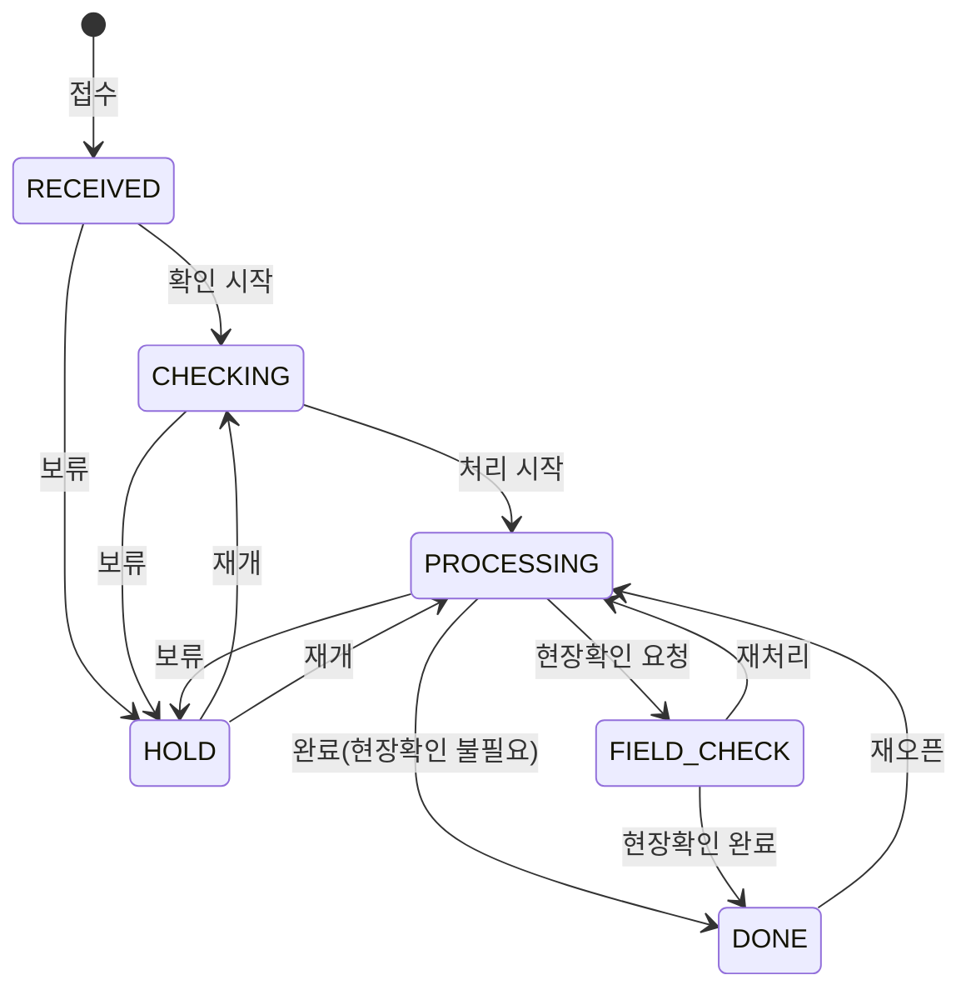
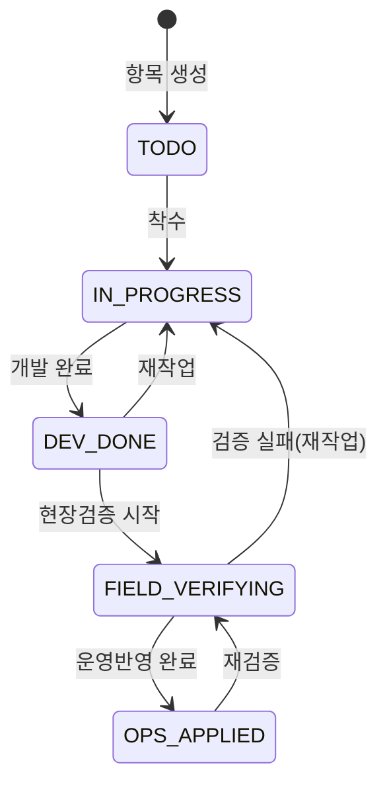
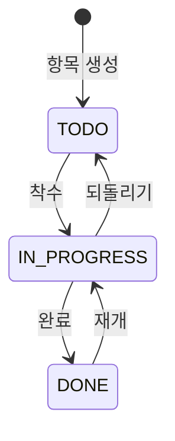
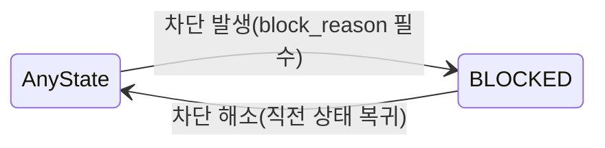
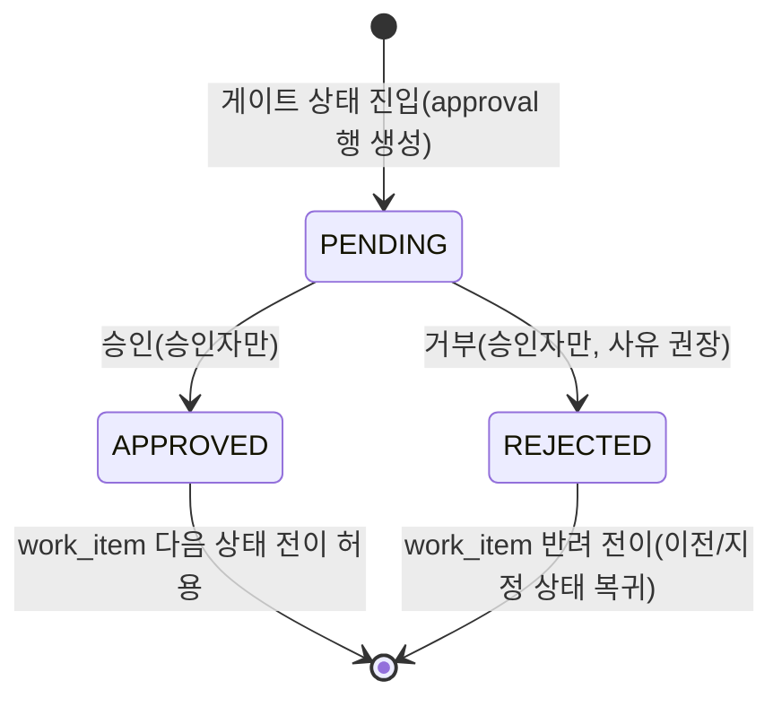
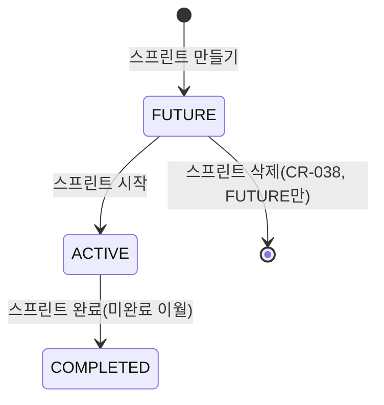
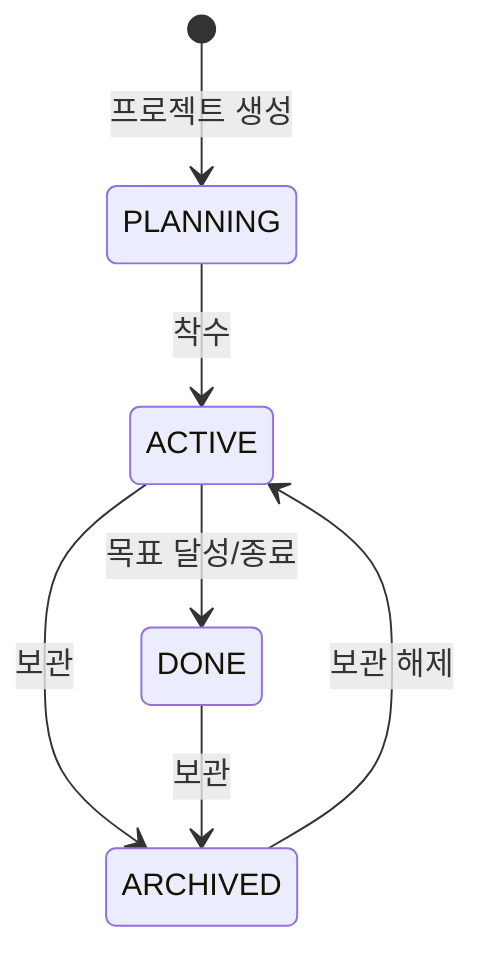
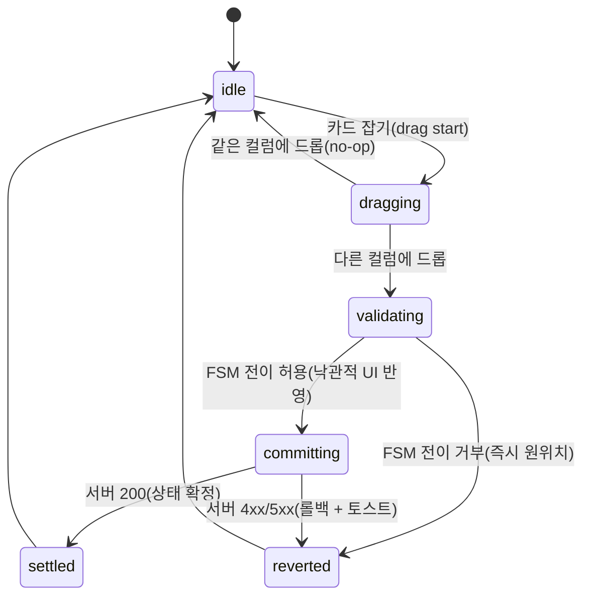
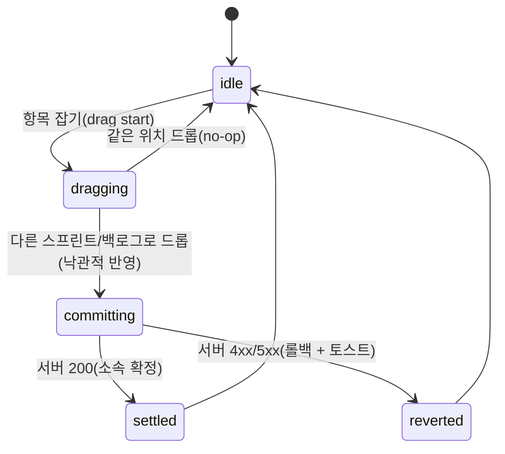

# WorkMap FSM 상태 정의

> 설계 버전: 2.0 | 최종 수정: 2026-06-23 | 관련 CR: CR-006

> 단계: 1. Requirements | 설계
>
> 모든 엔티티/UI 흐름의 상태 전이를 여기서 정의한다. 구현 시 상태 전이 검증의 기준이 된다.
> **화이트리스트 방식 — '허용 다음 상태'에 없는 전이는 전면 차단(BIZ-010).**

## v1.0(v0.3) → v2.0(v0.4) 변경 핵심

| 항목 | v1.0 (ClickUp) | v2.0 (Jira) |
|------|----------------|-------------|
| 상태 정의 | 코드 enum(공통상태 7종 하드코딩) | **워크플로 = 마스터 데이터(POL-001)** — 유형/프로젝트별로 다름 |
| 화이트리스트 | enum 전이표 고정 | **워크플로 마스터의 전이 정의** (관리자 편집 가능, 코드 변경 0) |
| 집계 | 공통상태가 권위 FSM | **워크플로 상태 → 공통 상태군 매핑**으로 회사홈 집계 |
| 신규 | (없음) | **sprint FSM**(기획서 §6.1) 추가 |

> **핵심 원칙: 워크플로는 코드 enum이 아니라 마스터 데이터다(POL-001).** `workflow(상태·전이)` 테이블에 유형/프로젝트별 워크플로를 시드로 등록하고, 관리자가 §13.5 워크플로 편집기로 상태·전이를 정의한다. 아래 워크플로 4종(개발형/운영형/현장검증형/범용형)은 **시스템 기본 시드**이며, 추가 워크플로는 행 추가로 확장(마이그레이션 불필요).

---

## 전체 요약

| 엔티티 | 상태 코드 목록 |
|--------|--------------|
| work_item — 개발형 워크플로 | TODO →(SELECTED)→ IN_PROGRESS → IN_REVIEW → DONE |
| work_item — 운영형 워크플로 | RECEIVED → CHECKING → PROCESSING → FIELD_CHECK → DONE / HOLD |
| work_item — 현장검증형 워크플로 | TODO → IN_PROGRESS → DEV_DONE → FIELD_VERIFYING → OPS_APPLIED |
| work_item — 범용 워크플로(CR-019) | TODO → IN_PROGRESS → DONE (되돌리기/재개 역전이 허용) |
| work_item — 공통 횡단 상태 | BLOCKED (어느 상태에서든 진입, 해제 시 직전 상태 복귀) |
| approval (승인 게이트, work_item 결합) | PENDING → APPROVED / REJECTED (게이트 상태의 전진 전이 조건) |
| sprint (스프린트) | FUTURE → ACTIVE → COMPLETED |
| project (프로젝트) | PLANNING → ACTIVE → DONE / ARCHIVED |
| UI: 보드 카드 드래그 | idle → dragging → validating → committing → settled / reverted |
| UI: 백로그↔스프린트 드래그 | idle → dragging → committing → settled / reverted |

> work_item의 status는 **소속 프로젝트/유형에 매핑된 워크플로의 상태 집합**에서만 값을 가진다. 워크플로마다 상태 코드와 전이가 다르므로, 단일 공통 status enum이 아니라 **워크플로 마스터를 참조**한다(POL-001).

---

## work_item 워크플로 (마스터 데이터, 기획서 §12)

> 각 워크플로는 `상태 코드 / 진입조건 / 허용 다음 상태(화이트리스트)` 표로 정의된다.
> **화이트리스트 방식**: '허용 다음 상태'에 없는 전이는 전면 차단(BIZ-010).
> **공통상태군 매핑**: 각 워크플로 상태는 집계용 공통 상태군(시작전/진행중/검토중/완료/보류/차단)으로 환산된다 — 회사홈·보고서 집계의 기준(POL-001).
> **공통 횡단 규칙**: BLOCKED 진입 시 block_reason 필수(BIZ-005), DONE 계열(DONE/OPS_APPLIED) 진입 시 completed_at 자동(BIZ-006).

### 1) 개발형 워크플로 (DEV)

> 적용: 개발형 프로젝트(§7.1). 칸반 표준 컬럼 = 백로그 → **개발하기로 선택됨(SELECTED)** → 진행 중 → 완료.
> **SELECTED 검토 메모(기획서 §9.1, §12)**: 칸반 표준 컬럼에 "개발하기로 선택됨" 포함을 검토 중. 시드에는 포함하되 프로젝트별 워크플로 편집기로 on/off 가능(관리자 마스터).

| 상태 코드 | 진입 조건 | 허용 다음 상태(화이트리스트) | 공통상태군 |
|-----------|-----------|------------------------------|-----------|
| TODO (할 일) | 항목 생성 시 기본값 | SELECTED, IN_PROGRESS | 시작전 |
| SELECTED (개발하기로 선택됨) | 백로그에서 개발 선택 | IN_PROGRESS, TODO | 시작전 |
| IN_PROGRESS (진행 중) | 착수 / 반려 / 재오픈 | IN_REVIEW, DONE | 진행중 |
| IN_REVIEW (검토 중) | 검토 요청 | DONE, IN_PROGRESS | 검토중 |
| DONE (완료) | 검토 통과 / 진행 완료 | IN_PROGRESS(재오픈) | 완료 |

- 관련 기능 ID: WMP-WI-007
- DONE 진입 시 completed_at 자동(BIZ-006), 재오픈 시 completed_at=null.

### 2) 운영형 워크플로 (OPS)

> 적용: 운영형 프로젝트(§7.2). 현장 대응·고객 요청·반복 운영. HOLD(보류)는 이 워크플로의 정식 상태.

| 상태 코드 | 진입 조건 | 허용 다음 상태(화이트리스트) | 공통상태군 |
|-----------|-----------|------------------------------|-----------|
| RECEIVED (접수) | 항목 생성 시 기본값 | CHECKING, HOLD | 시작전 |
| CHECKING (확인 중) | 확인 시작 / 보류 재개 | PROCESSING, HOLD | 진행중 |
| PROCESSING (처리 중) | 처리 시작 / 재처리 / 보류 재개 / 재오픈 | FIELD_CHECK, DONE, HOLD | 진행중 |
| FIELD_CHECK (현장확인) | 현장확인 요청 | DONE, PROCESSING | 검토중 |
| DONE (완료) | 현장확인 완료 / 처리 완료 | PROCESSING(재오픈) | 완료 |
| HOLD (보류) | 보류 처리 | CHECKING, PROCESSING | 보류 |

- 관련 기능 ID: WMP-WI-007
- DONE 진입 시 completed_at 자동(BIZ-006).
- **승인 게이트 예시**: 운영형에 승인 단계를 둘 경우, 게이트 상태(예: `CHECKING`[승인 게이트]→`PROCESSING`)는 `is_approval=true`로 지정한다. 진입 시 approval(PENDING) 생성, 전원 APPROVED 전까지 다음 상태 전진 차단(BIZ-110). 예: `검토 중[승인 게이트] → 처리 중`은 승인 통과 시에만 허용. 게이트 위치는 워크플로 마스터(POL-001)에서 지정.

### 3) 현장검증형 워크플로 (FIELD_VERIFY)

> 적용: 개발 완료와 운영 반영을 분리 추적하는 업무(§10.2, §10.3). 개발완료 ≠ 업무완료(운영검증까지 포함, §13.8-3).

| 상태 코드 | 진입 조건 | 허용 다음 상태(화이트리스트) | 공통상태군 |
|-----------|-----------|------------------------------|-----------|
| TODO (할 일) | 항목 생성 시 기본값 | IN_PROGRESS | 시작전 |
| IN_PROGRESS (진행 중) | 착수 / 재작업 | DEV_DONE | 진행중 |
| DEV_DONE (개발완료) | 개발 완료 | FIELD_VERIFYING, IN_PROGRESS | 진행중 |
| FIELD_VERIFYING (현장검증중) | 현장검증 시작 / 재검증 | OPS_APPLIED, IN_PROGRESS | 검토중 |
| OPS_APPLIED (운영반영완료) | 운영반영 완료 | FIELD_VERIFYING(재검증) | 완료 |

- 관련 기능 ID: WMP-WI-007, WMP-WI-016(측정), §10.2 현장검증 기록
- OPS_APPLIED 진입 시 completed_at 자동(BIZ-006). 현장검증 기록(검증자/검증일/결과)이 전이 트리거.

### 4) 범용 워크플로 (BASIC) — CR-019

> 적용: 디폴트 템플릿(DEFAULT) 등 특정 흐름이 정해지지 않은 범용 프로젝트. Jira "빈 스페이스"의 기본 워크플로에 해당. 가장 단순한 3단계 흐름이며, 사용자가 워크플로 편집기(§13.5)로 가감해 자기 흐름을 만드는 출발점.

| 상태 코드 | 진입 조건 | 허용 다음 상태(화이트리스트) | 공통상태군 |
|-----------|-----------|------------------------------|-----------|
| TODO (할 일) | 항목 생성 시 기본값 | IN_PROGRESS | 시작전 |
| IN_PROGRESS (진행 중) | 착수 / 재개 | DONE, TODO | 진행중 |
| DONE (완료) | 완료 | IN_PROGRESS(재개) | 완료 |

- DONE 진입 시 completed_at 자동(BIZ-006). 되돌리기/재개로 역전이 허용(범용이라 유연).
- 시스템 기본 시드(`workflow.is_system=true`). 디폴트 템플릿의 `default_workflow_id`로 참조.

### 공통 횡단 상태 — BLOCKED (막힘)

> 워크플로에 종속되지 않는 횡단 상태. **모든 워크플로의 모든 상태에서 진입 가능**, 해제 시 직전 상태로 복귀.

| 상태 코드 | 진입 조건 | 허용 다음 상태(화이트리스트) | 공통상태군 |
|-----------|-----------|------------------------------|-----------|
| BLOCKED (막힘) | 어느 상태에서든 차단 발생 | 직전 상태(prev_status로 복귀) | 차단 |

- 관련 기능 ID: WMP-WI-007, 회사홈 막힘 중심 대시보드(§9.2)
- **진입 시 block_reason 필수(BIZ-005).** 해제 시 block_reason은 이력으로 보존.
- BLOCKED 진입 직전 상태를 `prev_status`에 저장 → 해제 시 그 상태로만 복귀(화이트리스트).

---

## 승인 게이트 FSM (approval, work_item 워크플로와 결합)

> 승인 = work_item 워크플로의 **게이트**. 특정 상태(`workflow_status.is_approval=true`)에 도달하면 지정 승인자의 승인을 받아야 다음 단계로 진행한다(BIZ-110/111, POL-011).
> 게이트 상태의 전진 전이는 워크플로 화이트리스트에 정의돼 있어도 **승인 통과(전원 APPROVED) 조건부**다 — 승인 PENDING 동안은 전진 차단.
> 승인 자체는 아래 미니 FSM(approval.decision)을 따른다. 관련 기능 ID: WMP-OPS-005(승인 단계 설정), WMP-OPS-006(승인 요청·처리).

| 상태 코드 | 진입 조건 | 허용 다음 상태(화이트리스트) | work_item 영향 |
|-----------|-----------|------------------------------|----------------|
| PENDING (승인 대기) | 게이트 상태(is_approval=true) 진입 시 자동 생성 | APPROVED, REJECTED | 게이트 상태의 전진 전이 차단(BIZ-110) |
| APPROVED (승인됨) | 승인자(approver_role/approver_id)의 APPROVE. 다수 승인이면 **전원 APPROVED 시** 전이 | (최종) | 다음 상태 전이 허용 |
| REJECTED (거부됨) | 승인자의 REJECT(거부 사유 권장) | (최종) | 반려 전이 — 이전 상태(기본) 또는 지정 복귀 상태(POL-011) |

- **전이 권한**: PENDING→APPROVED, PENDING→REJECTED는 **지정 승인자만** 가능(BIZ-111). 그 외 사용자 차단. 요청자 자기승인 허용 여부는 POL-011.
- **다수 승인**: 기본 전원 동의(AND) — 전원 APPROVED 시에만 work_item 전진(POL-011). 1인 REJECT 시 즉시 반려.
- **결합 가드**: 게이트 상태에서의 전진 전이는 work_item FSM 화이트리스트 통과 + approval=APPROVED 두 조건을 모두 만족해야 허용된다.

---

## 워크플로 상태 → 공통 상태군 매핑 (POL-001, 집계 기준)

> 회사홈(§9.2)·보고서(§13.6)는 워크플로별 상태를 그대로 집계하지 않고 **공통 상태군**으로 환산해 전사 통합 지표를 만든다. 워크플로 마스터의 각 상태 행은 `common_status_group` 컬럼을 갖는다.

| 공통 상태군 | 환산되는 워크플로 상태(예시) |
|-------------|------------------------------|
| 시작전 | TODO, SELECTED, RECEIVED |
| 진행중 | IN_PROGRESS, CHECKING, PROCESSING, DEV_DONE |
| 검토중 | IN_REVIEW, FIELD_CHECK, FIELD_VERIFYING |
| 완료 | DONE, OPS_APPLIED |
| 보류 | HOLD |
| 차단 | BLOCKED |

> 새 워크플로/상태를 추가하면 그 상태 행에 공통 상태군만 지정하면 집계에 자동 편입(코드 변경 0).

---

## sprint (스프린트) — 신규, 기획서 §6.1

> 프로젝트당 동시 ACTIVE 스프린트는 **1개**. 백로그 화면에서 현재 스프린트 + 예정 스프린트 여러 개가 줄지어 표시되며, 상태가 액션 버튼을 결정한다.

> **편집(CR-038, WMP-AGL-007)**: 이름·기간·목표 수정은 상태 전이가 아니므로 어느 상태에서도 status를 바꾸지 않는다(별도 PATCH). 
> **삭제(CR-038, WMP-AGL-008)**: **FUTURE에서만** 허용. ACTIVE/COMPLETED 삭제 요청은 FSM 가드에서 거부(WMP-7847). 삭제 시 담긴 항목은 백로그로 복귀(sprint_id=NULL).

### FUTURE | 예정(미시작)
- **설명**: 생성되었으나 아직 시작하지 않은 스프린트. 백로그 화면에서 회색 표시.
- **진입 조건**: 스프린트 만들기
- **허용 다음 상태**: ACTIVE, (삭제)
- **비고**: `[스프린트 시작]` 버튼 — **앞 스프린트가 ACTIVE면 차단(회색)**. 동시 ACTIVE 1개/프로젝트 제약. **편집·삭제 가능**(CR-038): …메뉴에서 편집(이름·기간·목표) / 삭제(담긴 항목 백로그 복귀).
- **관련 기능 ID**: WMP-AGL-003, WMP-AGL-007(편집), WMP-AGL-008(삭제)

### ACTIVE | 진행 중
- **설명**: 현재 실행 중인 스프린트. Board(`/board`)가 이 스프린트의 항목을 칸반으로 표시.
- **진입 조건**: 스프린트 시작 (포함 항목·기간 고정)
- **허용 다음 상태**: COMPLETED
- **비고**: `[스프린트 완료]` 버튼. 프로젝트당 1개만 존재 가능. **편집 가능·삭제 불가**(CR-038, 진행 중 데이터 보호).
- **관련 기능 ID**: WMP-AGL-003, WMP-AGL-005(보드), WMP-AGL-007(편집)

### COMPLETED | 완료
- **설명**: 종료된 스프린트.
- **진입 조건**: 스프린트 완료
- **허용 다음 상태**: (최종 상태)
- **비고**: **완료 시 미완료 항목 → 다음 스프린트 또는 백로그로 이월(선택)**. 완료 후 ACTIVE로 되돌릴 수 없음. **편집 가능·삭제 불가**(CR-038, 완료 이력 보존).
- **관련 기능 ID**: WMP-AGL-004, WMP-AGL-007(편집)

---

## project (프로젝트)

### PLANNING | 계획
- **설명**: 생성되었으나 본격 진행 전
- **진입 조건**: 프로젝트 생성 시 기본값
- **허용 다음 상태**: ACTIVE
- **비고**: 운영형 프로젝트는 생성 즉시 ACTIVE로 둘 수 있음.
- **관련 기능 ID**: WMP-WS-002

### ACTIVE | 진행 중
- **설명**: 업무가 진행되는 활성 상태
- **진입 조건**: 착수 또는 보관 해제
- **허용 다음 상태**: DONE, ARCHIVED
- **관련 기능 ID**: WMP-WS-003

### DONE | 완료
- **설명**: 목표 달성 또는 종료
- **진입 조건**: 종료 처리
- **허용 다음 상태**: ARCHIVED
- **관련 기능 ID**: WMP-WS-004

### ARCHIVED | 보관
- **설명**: 목록에서 숨김(데이터 보존)
- **진입 조건**: 보관 처리(소프트)
- **허용 다음 상태**: ACTIVE (보관 해제)
- **관련 기능 ID**: WMP-WS-004

---

## UI FSM — 보드 카드 드래그 (기획서 §9.1)

> 낙관적 업데이트 + 서버 권위 롤백. 보드(칸반/스크럼)에서 카드를 다른 컬럼(상태)으로 옮길 때.

### idle | 대기
- **설명**: 사용자 조작 대기. 보드 정상 표시.
- **허용 다음 상태**: dragging
- **관련 기능 ID**: WMP-AGL-005

### dragging | 드래그 중
- **설명**: 카드를 잡고 이동 중
- **진입 조건**: drag start
- **허용 다음 상태**: idle(원위치), validating(타 컬럼 드롭)
- **관련 기능 ID**: WMP-AGL-005

### validating | 검증
- **설명**: 드롭 대상 컬럼으로의 전이가 해당 워크플로 화이트리스트에 있는지 클라이언트 선검증
- **허용 다음 상태**: committing(허용), reverted(거부)
- **비고**: 클라이언트 선검증은 UX용. 서버가 최종 권위(BLOCKED 사유 미입력 등은 서버에서만 판단). 워크플로 전이표는 마스터에서 받아 캐시.
- **관련 기능 ID**: WMP-AGL-005, WMP-WI-007

### committing | 반영 중
- **설명**: 낙관적으로 카드를 새 컬럼에 두고 PATCH 요청 발신
- **허용 다음 상태**: settled(성공), reverted(실패)
- **비고**: **BLOCKED로의 전이면 차단 사유 입력 모달을 먼저 띄운 뒤 committing 진입**(BIZ-005). 모달 취소 시 reverted.
- **관련 기능 ID**: WMP-AGL-005, WMP-WI-007

### settled | 확정
- **설명**: 서버 확정 응답. 카드 위치 고정.
- **허용 다음 상태**: idle
- **관련 기능 ID**: WMP-AGL-005

### reverted | 롤백
- **설명**: 전이 거부 또는 서버 실패 — 카드 원위치 + 에러 토스트
- **허용 다음 상태**: idle
- **관련 기능 ID**: WMP-AGL-005

---

## UI FSM — 백로그 ↔ 스프린트 드래그 (기획서 §9.1)

> 백로그 화면에서 항목을 스프린트↔백로그로 옮기거나 순서를 바꿀 때. 상태 전이가 아니라 **소속(sprint_id) 변경**이므로 validating(FSM 체크) 단계 없음.

### idle | 대기
- **설명**: 백로그 화면 정상 표시.
- **허용 다음 상태**: dragging
- **관련 기능 ID**: WMP-AGL-001

### dragging | 드래그 중
- **설명**: 항목 또는 스프린트 바닥글을 잡고 이동 중
- **진입 조건**: drag start
- **허용 다음 상태**: idle(원위치), committing(다른 영역 드롭)
- **관련 기능 ID**: WMP-AGL-002

### committing | 반영 중
- **설명**: 낙관적으로 항목을 새 영역에 두고 sprint_id 변경 PATCH 발신
- **허용 다음 상태**: settled(성공), reverted(실패)
- **비고**: ACTIVE 스프린트로 담는 경우 등 서버 제약 위반 시 reverted.
- **관련 기능 ID**: WMP-AGL-002

### settled | 확정
- **설명**: 서버 확정. 항목 소속 고정.
- **허용 다음 상태**: idle
- **관련 기능 ID**: WMP-AGL-002

### reverted | 롤백
- **설명**: 서버 실패 — 항목 원위치 + 에러 토스트
- **허용 다음 상태**: idle
- **관련 기능 ID**: WMP-AGL-002

---

## 작성 규칙

1. **워크플로 = 마스터 데이터(POL-001).** 상태/전이는 코드 enum이 아니라 `workflow` 테이블에 시드로 등록하고, 관리자가 워크플로 편집기(§13.5)로 유형/프로젝트별로 편집한다. 위 3종(개발형/운영형/현장검증형)은 시스템 기본 시드.
2. work_item.status는 소속 프로젝트/유형에 매핑된 워크플로의 상태 집합에서만 값을 가진다.
3. '허용 다음 상태'에 없는 전이는 전면 차단(BIZ-010, 화이트리스트). 정의 안 된 전이 = 거부.
4. BLOCKED는 워크플로 횡단 상태 — 어느 상태에서든 진입(block_reason 필수, BIZ-005), 해제 시 prev_status로만 복귀.
5. DONE 계열(DONE/OPS_APPLIED) 진입 시 completed_at 자동(BIZ-006). 재오픈 시 null.
6. 각 워크플로 상태는 공통 상태군(시작전/진행중/검토중/완료/보류/차단)으로 환산되어 회사홈·보고서 집계의 기준이 된다(POL-001).
7. sprint는 프로젝트당 동시 ACTIVE 1개. FUTURE→ACTIVE는 앞 스프린트 ACTIVE면 차단.
8. UI FSM(보드/백로그 드래그)은 낙관적 업데이트 + 서버 권위 롤백. 보드 드래그는 validating(FSM 선검증) 포함, 백로그 드래그는 소속 변경이라 미포함.
9. 승인 게이트 상태(is_approval=true)의 전진 전이는 화이트리스트 통과 + approval=APPROVED 조건부(BIZ-110). 승인/거부는 지정 승인자만(BIZ-111), 거부 시 이전/지정 상태로 반려(POL-011).
