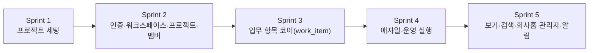

# WorkMap Sprint 구조도

> 설계 버전: 2.0 | 최종 수정: 2026-06-23 | 관련 CR: CR-006

> 단계: 1. Requirements | 설계
> 범위: **Phase 1(MVP, High 기능) = Sprint 1~5**. Phase 2+는 청사진(본 구현 범위 제외).
> 기반: 제품기획서 v0.4(Jira 애자일) — work_item 단일 테이블 + issue_type 계층, Backlog→Sprint→Board, 측정 추상화 Phase 1 포함.
> 풀스택: 각 Sprint **BE/FE 검증 기준 분리(필수)**. "API+페이지" 뭉뚱그림 금지.

---

## Sprint 의존관계

> 화살표 = 선행 완료 후 진행. Phase 1은 직렬 의존이 강해 순차 진행한다.
> work_item(S3)이 중심. 애자일/운영(S4), 보기/홈(S5)은 모두 work_item 파생 뷰이므로 S3 완료가 전제.

---

## Sprint 구조

### Sprint 1: 프로젝트 세팅

| 기능 ID | 작업 내용 | 의존 관계 | 검증 기준 | 담당 | 상태 |
|---------|----------|----------|----------|------|------|
| SET-BE | BE 초기화(Spring Boot 3 + Java 17 + MyBatis + PostgreSQL 16 + bp-common-lib 연동) | 없음 | BE: `./gradlew bootRun` → `GET /actuator/health` 200 | | |
| SET-BE2 | bp-common-lib 확장(ResponseDto 래핑, 7700번대 ErrorCode, JwtTokenProvider 상속, SecurityWhitelist 구현체) | SET-BE | BE: 임의 엔드포인트 응답이 ResponseDto 포맷, 화이트리스트 외 경로 401 | | |
| SET-FE | FE 초기화(React 19 + Vite + TS + ds-ui + React Router v6 + TanStack Query + Zustand) | 없음 | FE: `pnpm dev` 기동 + ds-ui Button 렌더 + `pnpm build` 성공 | | |
| SET-DB | Flyway 마이그레이션 + 시드(워크플로/세부상태, 측정단위 measure_unit, 업무유형 issue_type 5종, 역할) | SET-BE | BE: `flyway migrate` 성공 + 시드 row 존재(workflow/measure_unit/issue_type/role) | | |

> SET-DB 시드는 마스터 데이터(하드코딩 금지 원칙). issue_type 5종(Epic/Story/Task/Bug/Sub-task)·measure_unit 시스템 기본·워크플로 시작상태를 행으로 적재.

### Sprint 2: 인증·워크스페이스·프로젝트·멤버

| 기능 ID | 작업 내용 | 의존 관계 | 검증 기준 | 담당 | 상태 |
|---------|----------|----------|----------|------|------|
| WMP-AUTH-001~003-BE | 로그인/로그아웃/내 정보 | Sprint 1 | BE: `POST /api/v1/auth/login` → 200 + JWT 발급, `GET /auth/me` 🔒 200·무토큰 401, 비활성 계정 로그인 거부 | | |
| WMP-AUTH-001-FE | 로그인 페이지 | WMP-AUTH-001-BE | FE: 폼 입력 → 제출 → 토큰 저장 → 회사홈 리다이렉트 | | |
| WMP-AUTH-004/005-BE | 사용자 생성/초대·목록/수정/비활성화 | WMP-AUTH-001-BE | BE: `POST /api/v1/users` → 201 + 저장(이메일 UNIQUE), 비활성화 → 소프트 처리 | | |
| WMP-AUTH-004/005-FE | 사용자 관리 화면 | WMP-AUTH-004/005-BE | FE: 생성 폼 제출 → 목록 반영 / 비활성화 → 목록 상태 변경 | | |
| WMP-WS-001-BE | 워크스페이스 관리(생성·조회) | Sprint 1 | BE: `POST /api/v1/workspaces` → 201(Owner/Admin만), 목록 조회 200 | | |
| WMP-WS-002/003-BE | 프로젝트 생성(유형 프리셋)·목록/요약 | WMP-WS-001-BE | BE: `POST /api/v1/projects`(개발형/운영형/계획형 → 활성 탭 프리셋), 목록 필터(유형/상태)·`PageResponse`, 보관 기본 제외 | | |
| WMP-WS-002/003-FE | 프로젝트 목록·생성 화면 | 위 BE | FE: 생성 폼(유형 선택) → 목록 반영 / 필터 변경 → 목록 갱신 | | |
| WMP-WS-005-BE | 프로젝트 멤버 초대/역할/제거 | WMP-WS-002-BE, WMP-AUTH-004-BE | BE: 멤버 추가 → 201, 멤버만 담당자·멘션 대상 후보(WMP-WI 전제) | | |
| WMP-WS-005-FE | 멤버 초대/관리 화면 | 위 BE | FE: 멤버 추가 폼 → 목록 반영 / 역할 변경 → 반영 / 제거 → 목록 제거 | | |
| WMP-WS-006-BE/FE | 프로젝트 가시성(공개/비공개) | WMP-WS-002-BE | BE: PRIVATE 프로젝트는 멤버 외 목록/조회/검색 미노출(권한 필터). FE: 가시성 토글 → 비멤버 목록에서 사라짐 | | |

### Sprint 3: 업무 항목 코어 (work_item)

| 기능 ID | 작업 내용 | 의존 관계 | 검증 기준 | 담당 | 상태 |
|---------|----------|----------|----------|------|------|
| WMP-WI-001-BE | 업무 항목 생성(만들기) | Sprint 2 | BE: `POST /api/v1/work-items` → 201, key 자동발급(프로젝트키-순번), 초기상태=워크플로 시작상태(BIZ-101), 계층 정합성(BIZ-103) | | |
| WMP-WI-002/008-BE | 인라인 수정·우선순위/기한/라벨 | WMP-WI-001-BE | BE: `PATCH` 필드 변경 → 반영 + activity_log 기록, start_date ≤ due_date(BIZ-007) | | |
| WMP-WI-003-BE | 업무 항목 삭제(소프트) | WMP-WI-001-BE | BE: `DELETE` → deleted_at 세팅(BIZ-009), 하위 항목 함께 처리 | | |
| WMP-WI-004-BE | 상세 조회(유형별 분기) | WMP-WI-001-BE | BE: 상세 + 하위 + 댓글 + 이력 반환, 비공개 프로젝트 멤버 권한 확인(WMP-WS-006) | | |
| WMP-WI-005-BE | 하위 작업(Sub-task) 생성 | WMP-WI-001-BE | BE: parent 지정 생성 → Sub-task는 부모 필수·Epic은 Sub-task 부모 불가·depth≤2(BIZ-103), 순환 차단 | | |
| WMP-WI-006-BE | 담당자/보고자 지정·변경 | WMP-WI-001-BE, WMP-WS-005-BE | BE: 담당자/보고자는 프로젝트 멤버만, 배정 시 알림 이벤트 발행 | | |
| WMP-WI-007-BE | 상태 전이(FSM 화이트리스트) | WMP-WI-001-BE, T1-5 | BE: 허용 전이 200 / 금지 전이 거부, BLOCKED 전이 시 사유 필수(BIZ-005), DONE 전이 시 completed_at 자동(BIZ-006) | | |
| WMP-WI-009-BE | 댓글 + @멘션 | WMP-WI-001-BE | BE: 댓글 작성 → 201, 멘션 대상은 멤버, 멘션 시 알림 이벤트 발행 | | |
| WMP-WI-010-BE | 진행률 자동 집계(Epic/Story) | WMP-WI-005-BE | BE: 하위 완료 비율로 상위 progress(0~100) 자동 갱신(BIZ-008) | | |
| WMP-WI-011-BE | 활동/변경 이력 | WMP-WI-002-BE | BE: 상태 전이·담당자·필드 변경이 activity_log에 기록 | | |
| WMP-WI-012-BE | 첨부파일 | WMP-WI-001-BE | BE: 파일 업로드 → attachment 메타 저장, 첨부 목록 반환 | | |
| WMP-WI-016-BE | 목표·실적 측정(측정 추상화) | WMP-WI-001-BE, SET-DB | BE: measure_unit_id+target+current 저장 → progress 자동 계산(정량=현재÷목표, 정성=상태 기반) | | |
| WMP-WI-001~012/016-FE | 업무 항목 화면(만들기 모달·상세·인라인·상태·하위·댓글·측정) | 위 BE 전부 | FE: 만들기 모달 제출 → 상세 반영 / 인라인 편집 → 저장 / 상태 버튼 → FSM 전이 → UI 반영(실패 롤백) / 하위 추가 → 트리 반영 / 댓글·멘션 → 표시 | | |

### Sprint 4: 애자일/운영 실행

| 기능 ID | 작업 내용 | 의존 관계 | 검증 기준 | 담당 | 상태 |
|---------|----------|----------|----------|------|------|
| WMP-AGL-001-BE | 백로그 데이터(스프린트들 + 백로그) | Sprint 3 | BE: `GET /api/v1/projects/:id/backlog` → 현재+예정 스프린트들 + 백로그 영역(Epic 그룹), 스프린트 헤더 카운트 | | |
| WMP-AGL-001-FE | 백로그 화면 | WMP-AGL-001-BE | FE: 다중 스프린트 + 백로그 렌더 / Epic 그룹 펼침 / 인라인 만들기 | | |
| WMP-AGL-002-BE | 백로그↔스프린트 이동·순서 | WMP-AGL-001-BE | BE: `PATCH` sprint_id(또는 null) → 이동 반영, 순서 저장 | | |
| WMP-AGL-002-FE | 백로그↔스프린트 드래그 | 위 BE, T1-5 UI FSM | FE: 항목 드래그 → 스프린트로 이동(낙관적) / 실패 시 롤백+토스트 | | |
| WMP-AGL-003/004-BE | 스프린트 시작/완료(미완료 이월) | WMP-AGL-002-BE | BE: 시작 → ACTIVE(프로젝트당 동시 1개·앞 스프린트 진행 중이면 거부), 완료 → 미완료 항목 다음 스프린트/백로그 이월 + 스냅샷 | | |
| WMP-AGL-003/004-FE | 스프린트 시작/완료 UI | 위 BE | FE: [스프린트 시작] → ACTIVE 표시·앞 진행 중이면 비활성 / [완료] → 이월 대상 선택 모달 → 반영 | | |
| WMP-AGL-005-BE | 스크럼 보드 데이터(현재 스프린트 컬럼) | WMP-AGL-003-BE | BE: `GET .../board` → 상태별(백로그→선택됨→진행중→완료+막힘) 카드 목록 | | |
| WMP-AGL-005-FE | 스크럼 보드(상태 드래그) | 위 BE, WMP-WI-007-BE | FE: 카드 드롭 → WMP-WI-007(FSM) 호출 → 성공 확정 / 실패 롤백+토스트 | | |
| WMP-OPS-001-BE/FE | 운영 칸반 보드(운영형 컬럼) | Sprint 3 | BE: 운영형 워크플로(접수→확인중→처리중→현장확인→완료/보류) 컬럼별 카드. FE: 드롭 → FSM 검증 → UI 반영(실패 롤백) | | |
| WMP-OPS-002-BE/FE | 일일/주간 처리량 뷰 | WMP-WI-016-BE | BE: 담당자별 계획 대비 완료/미완료 집계(측정 추상화 정합). FE: 기간 선택 → 처리량 테이블 렌더 | | |
| WMP-OPS-003-BE/FE | 현장 이슈 → 개발 백로그 전환 | WMP-WI-001-BE | BE: 원본 work_item → 신규 백로그 항목 생성 + 원본↔신규 링크. FE: [개발로 전환] → 신규 항목 생성 + 링크 표시 | | |
| WMP-WI-014-BE/FE | 유형 전환(Move/Convert) | WMP-WI-001-BE | BE: issue_type 변경 → 계층 정합성 재검증(BIZ-103), 미사용 필드 보존. FE: 유형 변경 셀렉트 → 반영 | | |
| WMP-WI-015-BE/FE | 벌크 편집(일괄 변경) | WMP-WI-007-BE | BE: 다건 상태/담당자/스프린트/라벨/우선순위 일괄 변경, 상태는 항목별 FSM 검증·실패 분리 보고. FE: 다중 선택 → 일괄 변경 → 성공/실패 건수 표시 | | |

### Sprint 5: 보기·검색·회사홈·관리자·알림

| 기능 ID | 작업 내용 | 의존 관계 | 검증 기준 | 담당 | 상태 |
|---------|----------|----------|----------|------|------|
| WMP-VIEW-001-BE | 목록 데이터(표/분할) | Sprint 3 | BE: `GET /api/v1/work-items` 정렬·컬럼·`PageResponse` | | |
| WMP-VIEW-001-FE | 목록 뷰(표 ⇄ 분할 토글) | 위 BE | FE: 표/분할 토글 / 분할 시 행 클릭 → 우측 상세(페이지 이동 없이 갱신) / 인라인 상태 변경 | | |
| WMP-VIEW-004-BE | 검색·필터(기본/전문/퀵) | WMP-VIEW-001-BE | BE: 기본 필터(유형·상태·담당자·우선순위·라벨·스프린트·Epic·기한·막힘) + 전문 텍스트 검색(`SearchConditionRequest`) | | |
| WMP-VIEW-004-FE | 필터/검색/퀵필터 UI | 위 BE | FE: 필터 변경 → 목록 갱신 / 검색어 → 결과 / 퀵필터(내 항목·막힌 것·미배정) 토글 | | |
| WMP-HOME-001/002-BE | 막힘 중심 홈 + 지연/막힘/미배정 집계 | Sprint 4 | BE: `GET /api/v1/dashboard` → 막힘(BLOCKED)·지연(due<today AND status∉{완료,취소} POL-002)·미배정·장기 미변경 집계, 가시성 반영(볼 수 있는 프로젝트만) | | |
| WMP-HOME-001/002-FE | 회사 홈(업무지도) 화면 | 위 BE | FE: 막힘/지연/미배정 지표 카드 렌더 / 카드 클릭 → 해당 필터 목록 이동 | | |
| WMP-HOME-003-BE/FE | 프로젝트 보고서 | WMP-HOME-001-BE | BE: 프로젝트별 진행률/지연/막힘/담당자 부하 집계. FE: 프로젝트 선택 → 보고 지표 렌더 | | |
| WMP-ADM-001-BE/FE | 측정 단위 마스터 | SET-DB | BE: measure_unit CRUD(isSystem=true 삭제 불가). FE: 단위 생성/수정/삭제 → 목록 반영 | | |
| WMP-ADM-002-BE/FE | 필드 설정(필드 스킴) | Sprint 3 | BE: 유형/프로젝트별 필드 on/off 저장(BIZ-102 스키마 차등 없음). FE: 필드 토글 → work_item 화면 표시 반영 | | |
| WMP-ADM-003-BE/FE | 워크플로 편집기(상태/전이) | WMP-WI-007-BE | BE: 유형별 상태·전이 화이트리스트 정의(FSM 데이터 소스 BIZ-010). FE: 상태/전이 편집 → 저장 → FSM 반영 | | |
| WMP-NOTI-001/002-BE | 인앱 알림 + 받은함 + 트리거 발행 | Sprint 3(배정/멘션 이벤트), T1-6 | BE: 배정/멘션/마감/막힘 이벤트 → notification 발행, `GET /api/v1/notifications` 읽음/안읽음 목록 | | |
| WMP-NOTI-001-FE | 알림 받은함 UI | 위 BE | FE: 알림 벨 → 받은함 목록 / 읽음 처리 → 카운트 갱신 / 항목 클릭 → 대상 work_item 이동 | | |

---

## Phase 2+ (청사진 — Sprint 6 이후, 본 구현 범위 제외)

| 범위 | 기능 |
|---|---|
| 애자일 보고 | 번다운/번업(WMP-AGL-006), 벨로시티 |
| 보기 | 타임라인/로드맵(WMP-VIEW-002), 캘린더(WMP-VIEW-003) |
| 운영 | 현장검증 기록(WMP-OPS-004) |
| 협업/링크 | 연결된 업무 항목·이슈 링크(WMP-WI-013), 저장된 필터 |
| 관리자 | 업무 유형 관리(WMP-ADM-004), 양식 빌더(WMP-ADM-005) |
| Phase 3+ | 채널 소통(axopm opm-comm 이식), 자동화 룰, 외부 알림(Slack/Mail), 이슈수준 보안, AI(범위 밖) |

---

## Sprint 분리 원칙

1. 의존관계 순서로 직렬 배치(세팅 → 인증/워크스페이스 → work_item 코어 → 애자일/운영 → 보기/홈/관리자/알림).
2. 1 Sprint = Claude Code 1~2세션. 풀스택이므로 Sprint 내 **BE 세션 → FE 세션** 분리 권장(execution-spec 5-B).
3. 각 Sprint 검증 기준은 **BE/FE 분리**. "API+페이지" 뭉뚱그림 금지 — BE는 엔드포인트/검증 규칙, FE는 화면 조작으로 명시.
4. work_item(S3)이 모든 뷰의 원천 — S3 미완료 상태로 S4/S5 화면 착수 금지.
5. 마스터 데이터(측정단위·필드스킴·워크플로)는 하드코딩 금지 — S1 시드 + S5 편집기로 분리 구현.
6. Sprint 완료 시 CLAUDE.md 진행 상태 기록 후 commit.

---

## 검증 기준 작성 가이드 (FE 조작 필수)

| 기능 유형 | FE 검증 기준에 반드시 포함 |
|-----------|------------------------|
| 목록 | 데이터 표시 + 페이징/필터 동작 |
| 생성 | 폼/모달 입력 → 제출 → API 호출 → 성공 → 목록·상세 반영 |
| 수정 | 기존 로드 → 인라인/폼 수정 → 제출 → 반영 확인 |
| 삭제 | 삭제 버튼 → 확인 → API 호출 → 목록 제거(소프트) |
| 상태 변경 | 버튼/드래그 → API 호출 → FSM 전이 → UI 반영(실패 롤백+토스트) |
| 드래그 | 백로그↔스프린트/보드 드롭 → 낙관적 업데이트 → 서버 권위 확정/롤백 |
| 내보내기 | 필터 상태 → export → 파일 다운로드 확인 |

> BE 검증 기준은 엔드포인트 + 비즈니스 규칙(FSM·계층 정합성·필수값·권한)을 명시한다. "동작함" 같은 모호 표현 금지.

---

## Sprint 완료 게이트

| # | 게이트 항목 | 확인 방법 |
|---|-----------|----------|
| G-1 | T3-5 단위테스트 전체 통과 | `./gradlew test` / `pnpm test` |
| G-2 | BE: 모든 엔드포인트 생성(POST) Happy Path 동작 | Controller 테스트 또는 수동 호출 |
| G-3 | FE: 각 페이지 조작(CRUD/상태변경/드래그) UI 존재 + 동작 | 목록만 되는 것은 미완료 |
| G-4 | FE-BE: API 호출 성공(경로·필드·타입 일치) | FE → BE 실제 호출 정상 응답 |
| G-5 | T1-7 검증 기준 항목별 확인 | 각 행 검증 기준 하나씩 확인 |
| G-6 | 미완료 항목 명시 보고 | "M/N 완료. 미완료: [항목]" |

> **G-6 핵심**: 100% 아니어도 됨. 무엇이 안 되는지 거짓 없이 보고.
