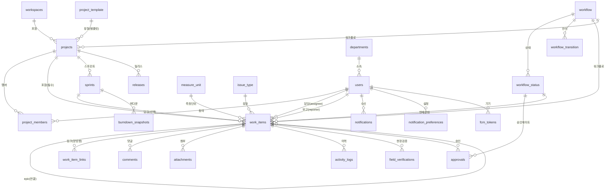

# WorkMap 데이터 모델 정의

> 설계 버전: 2.0 | 최종 수정: 2026-06-23 | 관련 CR: CR-006
> 단계: 3. Detail Design | 실행스펙 섹션 2에 포함
> DB: PostgreSQL 16.x · 영속성: MyBatis · PK: BIGINT GENERATED ALWAYS AS IDENTITY · 시각: TIMESTAMPTZ
> 범위: Phase 1(Sprint 1~5). Phase 2~3 엔티티는 "테이블만 선정의" 표기.

> **핵심 (v0.4): work_item 단일 테이블.** Epic/Story/Task/Bug/Sub-task는 별도 테이블이 아니라 `issue_type` + `parent_id`/`epic_id` 계층(기획서 §14, §15.1-5, BIZ-106). 유형별 필드는 단일 테이블에 두고 화면 표시만 차등(BIZ-102, 스키마 차등 없음).

---

## Enum 정의

> MyBatis는 String 코드로 저장하고 Enum 매핑(EnumTypeHandler 또는 String).

### IssueType (업무 항목 유형) — 기획서 §3.1
| 값 | depth | 설명 |
|----|-------|------|
| EPIC | 0 | 큰 기능/산출물 단위 |
| STORY | 1 | 사용자 관점 가치 |
| TASK | 1 | 기술/실무 작업 |
| BUG | 1 | 오류/결함 |
| SUBTASK | 2 | 세부 실행 작업 |

> 5종은 시스템 기본(issue_type 마스터에 isSystem=true 시드). 추가 유형(운영요청/승인요청/현장검증)은 Phase 2(WMP-ADM-004).

### Priority (우선순위) — POL-008
| 값 | 설명 |
|----|------|
| URGENT | 긴급 | HIGH | 높음 | NORMAL | 보통 | LOW | 낮음 |

### Severity (심각도, Bug용) — POL-005
| 값 | 설명 |
|----|------|
| CRITICAL | 치명 | HIGH | 높음 | MEDIUM | 보통 | LOW | 낮음 |

### CommonStatusGroup (집계용 공통 상태군) — T1-5
> 워크플로별 상태를 회사홈 집계 기준으로 환산. 비정규화 컬럼 `common_status`에 저장.

| 값 | 설명 |
|----|------|
| TODO | 시작 전 |
| IN_PROGRESS | 진행 중 |
| IN_REVIEW | 검토/확인 중 |
| DONE | 완료 |
| HOLD | 보류 |
| BLOCKED | 차단 |

### SprintStatus — T1-5
| 값 | 설명 |
|----|------|
| FUTURE | 예정(미시작) | ACTIVE | 진행 중 | COMPLETED | 완료 |

### ProjectStatus — T1-5
| 값 | 설명 |
|----|------|
| PLANNING | 계획 | ACTIVE | 진행 중 | DONE | 완료 | ARCHIVED | 보관 |

> **프로젝트 유형은 enum이 아니다.** "개발형/운영형/계획형"은 `project_template` **마스터 행**이며 관리자가 운영 중 추가/변경한다(BIZ-107, 기획서 §7 "유형은 고정이 아니라 기능 조합의 출발점"). 코드에 유형값을 하드코딩하지 않는다 — `projects.template_id → project_template.id`로 참조. DEV/OPS/PLAN은 Phase 1 **시드 예시**일 뿐(아래 Flyway 시드).

### Visibility — WMP-WS-006, BIZ-108
| 값 | 설명 |
|----|------|
| PUBLIC | 워크스페이스 전체 공개 | PRIVATE | 멤버만 |

### UserRole — POL-004
| 값 | 설명 |
|----|------|
| OWNER | 전체 관리 | ADMIN | 사용자·마스터 관리 | MANAGER | 프로젝트 관리 | MEMBER | 업무 생성/수정 | VIEWER | 읽기 전용 |

### LinkType (이슈 링크) — BIZ-109, 기획서 §13.1
| 값 | 역방향 | 설명 |
|----|--------|------|
| BLOCKS | BLOCKED_BY | A가 B를 막음 |
| BLOCKED_BY | BLOCKS | A가 B에 막힘 |
| RELATES_TO | RELATES_TO | 관련 |
| DUPLICATES | DUPLICATED_BY | 중복 |

### MeasureValueType (측정 단위 입력 형태) — POL-005, 기획서 §8.6
| 값 | 설명 |
|----|------|
| NUMBER | 수치(건수/금액/시간/리드타임) | BOOLEAN | 완료여부(정성) | SELECT | 선택지(SLA 달성/부분/미달) |

---

## 마스터 테이블 (관리자 관리, 시스템 시드 — BIZ-107)

### issue_type (업무 유형 마스터) — WMP-ADM-004
| 필드 | 타입 | 필수 | 기본값 | 설명 |
|------|------|------|--------|------|
| id | BIGINT | PK | auto | |
| code | VARCHAR(20) | Y | | EPIC/STORY/TASK/BUG/SUBTASK + 커스텀 |
| label | VARCHAR(40) | Y | | 표시명 |
| depth | INT | Y | | 0/1/2 (계층 정합성 BIZ-103) |
| color | VARCHAR(20) | N | | 칩 색상 |
| icon | VARCHAR(40) | N | | 아이콘 키 |
| is_system | BOOLEAN | Y | false | true=삭제 불가(5종 기본) |
| sort_order | INT | Y | 0 | |

**인덱스**: `uniq_issue_type_code`(code, UNIQUE)

### workflow (워크플로 마스터) — POL-001, WMP-ADM-003
| 필드 | 타입 | 필수 | 기본값 | 설명 |
|------|------|------|--------|------|
| id | BIGINT | PK | auto | |
| name | VARCHAR(60) | Y | | 개발형/운영형/현장검증형 등 |
| is_system | BOOLEAN | Y | false | |

> 유형↔워크플로 연결은 `project_template.default_workflow_id`가 담당(중복 컬럼 두지 않음). 프로젝트별 워크플로는 `projects.workflow_id`.

### workflow_status (워크플로 상태) — POL-001, T1-5
| 필드 | 타입 | 필수 | 기본값 | 설명 |
|------|------|------|--------|------|
| id | BIGINT | PK | auto | |
| workflow_id | BIGINT | Y | | → workflow.id |
| code | VARCHAR(40) | Y | | TODO/IN_PROGRESS/DEV_DONE 등 |
| label | VARCHAR(40) | Y | | 표시명 |
| common_status | VARCHAR(20) | Y | | CommonStatusGroup 환산값 |
| is_start | BOOLEAN | Y | false | 시작 상태(BIZ-101) |
| is_done | BOOLEAN | Y | false | 완료 상태(completed_at 자동) |
| is_approval | BOOLEAN | Y | false | **승인 게이트 상태**(WMP-OPS-005). 이 상태 진입 시 승인 필요 |
| approver_role | VARCHAR(20) | N | | 승인자 역할(role 기반 승인 시) |
| sort_order | INT | Y | 0 | 보드 컬럼 순서 |

**인덱스**: `uniq_wf_status`(workflow_id, code, UNIQUE), `idx_wf_status_order`(workflow_id, sort_order)

### workflow_transition (전이 화이트리스트) — BIZ-010, T1-5
| 필드 | 타입 | 필수 | 기본값 | 설명 |
|------|------|------|--------|------|
| id | BIGINT | PK | auto | |
| workflow_id | BIGINT | Y | | → workflow.id |
| from_status_id | BIGINT | Y | | → workflow_status.id |
| to_status_id | BIGINT | Y | | → workflow_status.id |

**인덱스**: `uniq_wf_transition`(workflow_id, from_status_id, to_status_id, UNIQUE)
> 이 테이블에 없는 (from→to)는 전면 차단(화이트리스트). BLOCKED는 횡단 전이로 별도 허용(서비스 처리).

### measure_unit (측정 단위 마스터) — POL-005, 기획서 §8.6
| 필드 | 타입 | 필수 | 기본값 | 설명 |
|------|------|------|--------|------|
| id | BIGINT | PK | auto | |
| name | VARCHAR(40) | Y | | 건수/금액/퍼센트/시간/완료여부/리드타임/SLA |
| value_type | VARCHAR(20) | Y | | MeasureValueType |
| suffix | VARCHAR(20) | N | | 건/원/%/시간 |
| options | JSONB | N | | SELECT일 때 선택지 |
| is_system | BOOLEAN | Y | false | true=삭제 불가 |
| sort_order | INT | Y | 0 | |

**인덱스**: `idx_measure_unit_system`(is_system)

### field_scheme (필드 스킴) — POL-006, WMP-ADM-002
| 필드 | 타입 | 필수 | 기본값 | 설명 |
|------|------|------|--------|------|
| id | BIGINT | PK | auto | |
| project_id | BIGINT | N | | → projects.id (null=전역 기본) |
| issue_type_code | VARCHAR(20) | Y | | 적용 유형 |
| field_key | VARCHAR(40) | Y | | acceptance_criteria/severity/story_points 등 |
| is_visible | BOOLEAN | Y | true | 표시 on/off |
| is_required | BOOLEAN | Y | false | 필수 여부 |
| sort_order | INT | Y | 0 | |

**인덱스**: `uniq_field_scheme`(project_id, issue_type_code, field_key, UNIQUE)
> 단일 테이블 + 화면 표시 차등(BIZ-102). 스키마는 안 바뀌고 표시 여부만 제어.

### project_template (프로젝트 유형 마스터) — POL-010, 기획서 §7
> "프로젝트 유형"의 단일 진실 소스. 코드 enum이 아니라 이 테이블의 행이 곧 선택 가능한 유형이다(BIZ-107). 관리자가 행 추가로 새 유형을 만든다(코드 변경 0).

| 필드 | 타입 | 필수 | 기본값 | 설명 |
|------|------|------|--------|------|
| id | BIGINT | PK | auto | |
| code | VARCHAR(30) | Y | | 식별 코드(DEV/OPS/PLAN + 커스텀). UNIQUE |
| name | VARCHAR(60) | Y | | 표시명(개발형/운영형/계획형 등) |
| description | VARCHAR(200) | N | | 유형 설명 |
| icon | VARCHAR(40) | N | | 템플릿 아이콘 키 |
| default_tabs | JSONB | Y | | 활성 탭 배열(["backlog","board",...]) |
| default_workflow_id | BIGINT | N | | → workflow.id (기본 워크플로) |
| issue_type_codes | JSONB | Y | '[]' | **이 템플릿이 쓸 업무 유형 목록**(["EPIC","STORY",...]). 빈 배열=전체 5종 |
| is_system | BOOLEAN | Y | false | true=시스템 시드(삭제 불가). 커스텀=false |
| sort_order | INT | Y | 0 | |

**인덱스**: `uniq_project_template_code`(code, UNIQUE)
> 템플릿이 묶는 것 = **탭 조합 + 워크플로 + 업무 유형 목록 + 필드 스킴**(Jira 템플릿과 동일 범위). Phase 1은 **프로젝트 생성 시 템플릿값을 프로젝트로 복사**(active_tabs/workflow_id/노출 유형)하고 이후 프로젝트별 편집(WMP-WS-004).
> **템플릿 추가/수정은 전용 관리 화면·API를 만들지 않는다(사용자 결정 2026-06-23).** 빈도가 낮은 운영 작업이므로 **DB 직접 수정 또는 Flyway 시드 SQL**로 처리한다(측정단위·필드스킴·워크플로처럼 관리자 화면을 두지 않음). is_system=false 행을 직접 INSERT/UPDATE하면 즉시 새 유형으로 노출된다(코드/배포 불필요, BIZ-107).

---

## 핵심 엔티티

### users (사용자)
| 필드 | 타입 | 필수 | 기본값 | 설명 |
|------|------|------|--------|------|
| id | BIGINT | PK | auto | |
| email | VARCHAR(255) | Y | | UNIQUE, 로그인 ID |
| password_hash | VARCHAR(255) | Y | | bcrypt |
| name | VARCHAR(50) | Y | | |
| role | VARCHAR(20) | Y | MEMBER | UserRole(전역 기본 역할) |
| department_id | BIGINT | N | | → departments.id |
| is_active | BOOLEAN | Y | true | 비활성=소프트삭제 |
| created_at | TIMESTAMPTZ | Y | now() | |
| updated_at | TIMESTAMPTZ | Y | now() | |

**인덱스**: `uniq_users_email`(email, UNIQUE), `idx_users_department_id`(department_id)

> **CR-027 주의**: users 스키마는 **무변경**. 초대 단계에서는 user를 만들지 않고, 초대 수락(토큰 검증 + 비밀번호 설정) 완료 시점에만 user를 생성하므로 `password_hash NOT NULL` 불변식이 유지된다.
> **CR-027 토큰 보정(V11)**: 초대·분실재설정의 본인확인을 **인증번호(OTP)→토큰 링크**로 전환. invitations에 `token_hash` 추가, `password_reset_tokens` 신설. `email_otp`는 **CHANGE 전용**으로 축소(로그인 상태 변경만 OTP 유지).

### invitations (사용자 초대) — WMP-AUTH-004, CR-027(토큰 보정)
| 필드 | 타입 | 필수 | 기본값 | 설명 |
|------|------|------|--------|------|
| id | BIGINT | PK | auto | |
| email | VARCHAR(255) | Y | | 초대 대상 이메일 |
| name | VARCHAR(50) | Y | | 초대 시 지정 이름(user 생성에 승계) |
| role | VARCHAR(20) | Y | MEMBER | UserRole(생성될 user의 전역 역할) |
| department_id | BIGINT | N | | → departments.id (user에 승계) |
| status | VARCHAR(20) | Y | PENDING | PENDING / ACCEPTED / EXPIRED / REVOKED |
| token_hash | VARCHAR(255) | Y | | **초대 수락 토큰 해시(SHA-256)**. 평문은 메일 링크로만 전달·미저장. 재발송 시 갱신(V11) |
| workspace_id | BIGINT | N | | → workspaces.id (**CR-033 V13**). 지정 시 수락 완료 시점에 그 WS 멤버로 자동 합류. null=WS 미지정(가입 후 미소속) |
| invited_by | BIGINT | Y | | → users.id (초대한 관리자) |
| expires_at | TIMESTAMPTZ | Y | | 초대/토큰 만료(발급+72h, POL-013) |
| accepted_at | TIMESTAMPTZ | N | | 수락 완료 시각 |
| created_at | TIMESTAMPTZ | Y | now() | |
| updated_at | TIMESTAMPTZ | Y | now() | |

**인덱스**: `idx_invitations_email`(email), `idx_invitations_status`(status), `idx_invitations_token_hash`(token_hash). **부분 유니크**: `uniq_invitations_pending_email`(email) WHERE status='PENDING'.
**규칙**: 수락은 token_hash로 조회(미소비·미만료·PENDING). 토큰은 추측 불가 고엔트로피라 시도횟수 제한 불요(POL-013-A). 재발송 시 새 토큰 발급(이전 무효). **CR-033**: 수락(user 생성) 직후 `workspace_id`가 있으면 같은 트랜잭션에서 `workspace_members`에 자동 insert(WorkspaceService.addMember 재사용, ON CONFLICT DO NOTHING) — 신규 가입자가 빈 WS 선택 화면에 갇히지 않게.

### signup_requests (가입 요청) — WMP-AUTH-010, CR-032
> 계정 없는 사람의 셀프 가입 신청. user 미생성 — 관리자 승인 시 초대(invitations)로 이관. status: PENDING/APPROVED/REJECTED.

| 필드 | 타입 | 필수 | 기본값 | 설명 |
|------|------|------|--------|------|
| id | BIGINT | PK | auto | |
| email | VARCHAR(255) | Y | | 신청 이메일 |
| name | VARCHAR(50) | Y | | 신청 이름 |
| reason | VARCHAR(500) | N | | 신청 사유(선택) |
| status | VARCHAR(20) | Y | PENDING | PENDING / APPROVED / REJECTED |
| processed_by | BIGINT | N | | → users.id (승인·거절한 관리자) |
| reject_reason | VARCHAR(500) | N | | 거절 사유(선택) |
| processed_at | TIMESTAMPTZ | N | | 처리 시각 |
| created_at | TIMESTAMPTZ | Y | now() | |
| updated_at | TIMESTAMPTZ | Y | now() | |

**인덱스**: `idx_signup_requests_status`(status). **부분 유니크**: `uniq_signup_pending_email`(email) WHERE status='PENDING' — 같은 이메일 대기 신청 중복 차단.
**규칙**: 신청 시 이미 가입된 이메일이면 거부. 승인은 역할 지정 후 InvitationService.invite 위임(초대 토큰 발송) → APPROVED. 거절은 REJECTED(사유 선택).

### password_reset_tokens (비밀번호 재설정 토큰) — WMP-AUTH-007, POL-013, CR-027(토큰 보정)
> 분실 재설정 링크 토큰. 평문 미저장(해시). 짧은 만료(30분).

| 필드 | 타입 | 필수 | 기본값 | 설명 |
|------|------|------|--------|------|
| id | BIGINT | PK | auto | |
| user_id | BIGINT | Y | | → users.id (발급 시점에 계정 존재 확인) |
| token_hash | VARCHAR(255) | Y | | 재설정 토큰 해시(SHA-256). URL `?token=`로 전달 |
| consumed_at | TIMESTAMPTZ | N | | 재설정 완료·소비 시각(1회용) |
| expires_at | TIMESTAMPTZ | Y | | 발급+30분(POL-013) |
| created_at | TIMESTAMPTZ | Y | now() | |

**인덱스**: `idx_prt_token_hash`(token_hash), `idx_prt_user`(user_id), `idx_prt_expires`(expires_at).
**규칙**: 같은 user에 새 토큰 발급 시 이전 미소비 무효화. 검증은 미소비·미만료 최신. 계정 열거 방지로 미존재/비활성 이메일은 발급·발송 안 함(응답은 동일).

### email_otp (이메일 인증번호 — CHANGE 전용) — WMP-AUTH-008, POL-013-B, CR-027
> **CR-027 토큰 보정으로 CHANGE 전용 축소**(INVITE/RESET는 토큰으로 이관). 로그인 상태 비밀번호 변경의 2차 인증 6자리. 평문 미저장(해시).

| 필드 | 타입 | 필수 | 기본값 | 설명 |
|------|------|------|--------|------|
| id | BIGINT | PK | auto | |
| email | VARCHAR(255) | Y | | 수신 이메일(로그인 사용자 본인) |
| purpose | VARCHAR(20) | Y | CHANGE | CHANGE(만). (INVITE/RESET는 더 이상 사용 안 함) |
| code_hash | VARCHAR(255) | Y | | 6자리 인증번호 해시 |
| user_id | BIGINT | N | | → users.id (로그인 사용자) |
| attempt_count | INT | Y | 0 | 검증 시도 횟수(최대 5, POL-013-B) |
| consumed_at | TIMESTAMPTZ | N | | 검증 성공·소비 시각(1회용) |
| expires_at | TIMESTAMPTZ | Y | | 발급+10분 |
| created_at | TIMESTAMPTZ | Y | now() | |

**인덱스**: `idx_email_otp_lookup`(email, purpose, consumed_at), `idx_email_otp_expires`(expires_at).
**규칙**: 시도횟수 카운팅은 검증실패 예외와 분리해 독립 커밋(brute-force 방어, CR-027 버그픽스). 재발송 쿨다운 60초. (기존 테이블 유지 — V11에서 컬럼 변경 없음, 용도만 CHANGE로 좁힘.)

### departments (부서)
| 필드 | 타입 | 필수 | 기본값 | 설명 |
|------|------|------|--------|------|
| id | BIGINT | PK | auto | |
| name | VARCHAR(100) | Y | | |
| parent_id | BIGINT | N | | → departments.id |
| created_at / updated_at | TIMESTAMPTZ | Y | now() | |

### workspaces (워크스페이스) — WMP-WS-001
| 필드 | 타입 | 필수 | 기본값 | 설명 |
|------|------|------|--------|------|
| id | BIGINT | PK | auto | |
| name | VARCHAR(150) | Y | | 회사/큰 업무 공간 |
| description | TEXT | N | | |
| created_by | BIGINT | Y | | → users.id |
| created_at / updated_at | TIMESTAMPTZ | Y | now() | |

### workspace_members (워크스페이스 멤버 N:M) — WMP-WS-007 (CR-018 신설)
| 필드 | 타입 | 필수 | 기본값 | 설명 |
|------|------|------|--------|------|
| workspace_id | BIGINT | Y | | → workspaces.id |
| user_id | BIGINT | Y | | → users.id |
| created_at | TIMESTAMPTZ | Y | now() | |

**인덱스**: `pk_workspace_members`(workspace_id, user_id, PK), `idx_workspace_members_user`(user_id)
> **WS 멤버십 = 1차 격리 경계(BIZ-112).** 모든 목록/검색/대시보드/받은함은 이 테이블로 "내가 속한 WS"를 판정해 스코프. role 컬럼 없음 — WS별 Admin 안 둠(전사 Admin만, CR-018). 프로젝트 멤버(project_members)의 전제: WS 멤버여야 그 안 프로젝트 멤버 가능.

### projects (프로젝트) — WMP-WS-002
| 필드 | 타입 | 필수 | 기본값 | 설명 |
|------|------|------|--------|------|
| id | BIGINT | PK | auto | |
| workspace_id | BIGINT | Y | | → workspaces.id |
| key | VARCHAR(10) | Y | | 프로젝트 키(ZGOH 등). work_item key 접두 |
| name | VARCHAR(200) | Y | | |
| template_id | BIGINT | Y | | → project_template.id (유형. enum 아님, BIZ-107) |
| status | VARCHAR(20) | Y | PLANNING | ProjectStatus |
| visibility | VARCHAR(20) | Y | PUBLIC | Visibility(BIZ-108) |
| workflow_id | BIGINT | N | | → workflow.id (생성 시 템플릿 default_workflow에서 복사, 이후 변경 가능) |
| active_tabs | JSONB | N | | 활성 탭(생성 시 템플릿 default_tabs에서 복사, 편집 가능) |
| seq_counter | INT | Y | 0 | work_item key 채번용(프로젝트별 순번) |
| start_date | DATE | N | | |
| end_date | DATE | N | | |
| description | TEXT | N | | |
| created_by | BIGINT | Y | | → users.id |
| archived_at | TIMESTAMPTZ | N | | 보관(소프트) |
| created_at / updated_at | TIMESTAMPTZ | Y | now() | |

**인덱스**: `uniq_projects_key`(key, UNIQUE), `idx_projects_workspace`(workspace_id), `idx_projects_template`(template_id), `idx_projects_status`(status)

### project_members (프로젝트 멤버 N:M) — WMP-WS-005
| 필드 | 타입 | 필수 | 기본값 | 설명 |
|------|------|------|--------|------|
| project_id | BIGINT | Y | | → projects.id |
| user_id | BIGINT | Y | | → users.id |
| role | VARCHAR(20) | Y | MEMBER | 프로젝트 내 역할(POL-004) |
| created_at | TIMESTAMPTZ | Y | now() | |

**인덱스**: `pk_project_members`(project_id, user_id, PK), `idx_project_members_user`(user_id)
> 비공개 프로젝트 조회 권한의 기준(BIZ-108). 담당자/보고자/멘션 대상은 멤버만.

### sprints (스프린트) — WMP-AGL-003
| 필드 | 타입 | 필수 | 기본값 | 설명 |
|------|------|------|--------|------|
| id | BIGINT | PK | auto | |
| project_id | BIGINT | Y | | → projects.id |
| name | VARCHAR(100) | Y | | 스프린트 1 등 |
| goal | VARCHAR(300) | N | | 스프린트 목표 |
| status | VARCHAR(20) | Y | FUTURE | SprintStatus |
| start_date | DATE | N | | 시작 시 고정 |
| end_date | DATE | N | | |
| sort_order | INT | Y | 0 | 백로그 화면 정렬 |
| started_at | TIMESTAMPTZ | N | | |
| completed_at | TIMESTAMPTZ | N | | |
| created_at / updated_at | TIMESTAMPTZ | Y | now() | |

**인덱스**: `idx_sprints_project`(project_id, status)
> 동시 ACTIVE 1개/프로젝트(서비스 검증, T1-5).

### releases (릴리스/버전) — 기획서 §4, Phase 1 테이블 정의
| 필드 | 타입 | 필수 | 기본값 | 설명 |
|------|------|------|--------|------|
| id | BIGINT | PK | auto | |
| project_id | BIGINT | Y | | → projects.id |
| name | VARCHAR(100) | Y | | WMS v1.0 등 |
| released_at | DATE | N | | |
| created_at | TIMESTAMPTZ | Y | now() | |

### work_items (업무 항목 — 핵심 단일 테이블) ★
| 필드 | 타입 | 필수 | 기본값 | 설명 |
|------|------|------|--------|------|
| id | BIGINT | PK | auto | |
| key | VARCHAR(20) | Y | | 프로젝트키-순번(ZGOH-5). UNIQUE |
| project_id | BIGINT | Y | | → projects.id (BIZ-001) |
| issue_type | VARCHAR(20) | Y | TASK | → issue_type.code |
| parent_id | BIGINT | N | | → work_items.id (Sub-task의 부모, BIZ-103) |
| epic_id | BIGINT | N | | → work_items.id (Epic 연결, Story/Task/Bug) |
| title | VARCHAR(300) | Y | | 요약 |
| description | TEXT | N | | 리치 텍스트 |
| workflow_id | BIGINT | Y | | → workflow.id (이 항목의 워크플로) |
| status_id | BIGINT | Y | | → workflow_status.id |
| common_status | VARCHAR(20) | Y | TODO | 집계용 환산값(비정규화, BIZ-106) |
| priority | VARCHAR(20) | Y | NORMAL | Priority |
| assignee_id | BIGINT | N | | → users.id (BIZ-002 미배정 허용) |
| reporter_id | BIGINT | N | | → users.id |
| sprint_id | BIGINT | N | | → sprints.id (백로그=null) |
| story_points | INT | N | | Story/Task(수동, §8.4) |
| estimate_hours | NUMERIC(6,2) | N | | 공수 예상(수동) |
| spent_hours | NUMERIC(6,2) | N | | 공수 실제(워크로그 합산, Phase2) |
| start_date | DATE | N | | BIZ-007 |
| due_date | DATE | N | | 지연 판단(POL-002) |
| progress | INT | Y | 0 | 0~100 (BIZ-008 자동 / 측정 기반 BIZ-105) |
| block_reason | VARCHAR(500) | N | | BLOCKED 시 필수(BIZ-005) |
| **measure_unit_id** | BIGINT | N | | → measure_unit.id (측정 추상화 §8.5) |
| **target_value** | NUMERIC(18,2) | N | | 목표값 |
| **current_value** | NUMERIC(18,2) | N | | 현재값 |
| acceptance_criteria | JSONB | N | | Story 인수조건(배열) |
| steps_to_reproduce | JSONB | N | | Bug 재현절차(배열) |
| expected_result | TEXT | N | | Bug 기대 |
| actual_result | TEXT | N | | Bug 실제 |
| environment | VARCHAR(200) | N | | Bug 환경 |
| severity | VARCHAR(20) | N | | Bug 심각도(POL-005) |
| checklist | JSONB | N | | Task 체크리스트([{text,done}]) |
| labels | JSONB | N | '[]' | 라벨 배열 |
| related_solutions | JSONB | N | '[]' | 관련 솔루션(WMS/OMS 등, §10.1) |
| ops_apply_status | VARCHAR(30) | N | | 운영반영 상태(§10.3) |
| status_changed_at | TIMESTAMPTZ | Y | now() | 장기미변경 판정(POL-003) |
| completed_at | TIMESTAMPTZ | N | | DONE 시 자동(BIZ-006) |
| deleted_at | TIMESTAMPTZ | N | | 소프트삭제(BIZ-009) |
| created_by | BIGINT | Y | | → users.id |
| created_at / updated_at | TIMESTAMPTZ | Y | now() | |

**인덱스**:
- `uniq_work_items_key`(key, UNIQUE)
- `idx_wi_project`(project_id), `idx_wi_type`(issue_type), `idx_wi_parent`(parent_id), `idx_wi_epic`(epic_id)
- `idx_wi_assignee`(assignee_id), `idx_wi_sprint`(sprint_id), `idx_wi_common_status`(common_status)
- `idx_wi_due`(due_date), `idx_wi_delay`(common_status, due_date) — 지연 집계 복합
- `idx_wi_active`(deleted_at) — 부분 인덱스 `WHERE deleted_at IS NULL`

> 유형 고유 필드(acceptance_criteria/steps_to_reproduce/checklist 등)는 다른 유형에선 NULL(BIZ-102, 화면 표시만 차등). `common_status`는 status_id 환산값 비정규화 — 상태 변경 시 트랜잭션 내 동기화.

### work_item_links (이슈 링크) — WMP-WI-013, BIZ-109
| 필드 | 타입 | 필수 | 기본값 | 설명 |
|------|------|------|--------|------|
| id | BIGINT | PK | auto | |
| source_id | BIGINT | Y | | → work_items.id |
| target_id | BIGINT | Y | | → work_items.id |
| link_type | VARCHAR(20) | Y | | LinkType |
| created_at | TIMESTAMPTZ | Y | now() | |

**인덱스**: `uniq_wi_link`(source_id, target_id, link_type, UNIQUE), `idx_wi_link_target`(target_id)
> 양방향 자동: source→target(BLOCKS)면 역방향 행(target→source, BLOCKED_BY)도 저장. 자기참조 금지.

### comments (댓글) — WMP-WI-009
| 필드 | 타입 | 필수 | 기본값 | 설명 |
|------|------|------|--------|------|
| id | BIGINT | PK | auto | |
| work_item_id | BIGINT | Y | | → work_items.id |
| author_id | BIGINT | Y | | → users.id |
| content | TEXT | Y | | |
| mentioned_user_ids | JSONB | N | '[]' | 멘션 사용자 ID 배열 |
| created_at / updated_at | TIMESTAMPTZ | Y | now() | |

**인덱스**: `idx_comments_work_item`(work_item_id)

### attachments (첨부) — WMP-WI-012
| 필드 | 타입 | 필수 | 기본값 | 설명 |
|------|------|------|--------|------|
| id | BIGINT | PK | auto | |
| work_item_id | BIGINT | Y | | → work_items.id |
| file_name | VARCHAR(255) | Y | | |
| file_path | VARCHAR(500) | Y | | 저장 경로/키 |
| file_size | BIGINT | N | | |
| content_type | VARCHAR(100) | N | | |
| uploaded_by | BIGINT | Y | | → users.id |
| created_at | TIMESTAMPTZ | Y | now() | |

**인덱스**: `idx_attachments_work_item`(work_item_id)

### activity_logs (활동 이력) — WMP-WI-011
| 필드 | 타입 | 필수 | 기본값 | 설명 |
|------|------|------|--------|------|
| id | BIGINT | PK | auto | |
| work_item_id | BIGINT | Y | | → work_items.id |
| actor_id | BIGINT | Y | | → users.id |
| action | VARCHAR(40) | Y | | STATUS_CHANGE/ASSIGN/FIELD_UPDATE/TYPE_CONVERT/LINK |
| from_value | VARCHAR(200) | N | | |
| to_value | VARCHAR(200) | N | | |
| created_at | TIMESTAMPTZ | Y | now() | |

**인덱스**: `idx_activity_logs_work_item`(work_item_id, created_at)

### field_verifications (현장검증 기록) — WMP-OPS-004, 기획서 §10.2
| 필드 | 타입 | 필수 | 기본값 | 설명 |
|------|------|------|--------|------|
| id | BIGINT | PK | auto | |
| work_item_id | BIGINT | Y | | → work_items.id |
| verifier | VARCHAR(60) | Y | | 검증자 |
| verified_date | DATE | Y | | 검증일 |
| location | VARCHAR(200) | N | | 장소 |
| environment | VARCHAR(200) | N | | 환경 |
| test_content | TEXT | N | | 테스트 내용 |
| result | VARCHAR(20) | Y | | PASS/FAIL/PARTIAL |
| issues_found | TEXT | N | | 발견 이슈 |
| created_at | TIMESTAMPTZ | Y | now() | |

**인덱스**: `idx_field_verif_work_item`(work_item_id)
> Phase 1 테이블 정의, 화면은 Phase 2(WMP-OPS-004 Medium).

### approvals (승인) — WMP-OPS-005/006
| 필드 | 타입 | 필수 | 기본값 | 설명 |
|------|------|------|--------|------|
| id | BIGINT | PK | auto | |
| work_item_id | BIGINT | Y | | → work_items.id |
| status_id | BIGINT | Y | | → workflow_status.id (어느 승인 게이트인지) |
| requested_by | BIGINT | Y | | → users.id (요청 발생자/시스템) |
| approver_id | BIGINT | N | | → users.id (지정 승인자. role 승인이면 null) |
| approver_role | VARCHAR(20) | N | | role 기반 승인 시 역할 |
| decision | VARCHAR(20) | Y | PENDING | PENDING / APPROVED / REJECTED |
| comment | VARCHAR(500) | N | | 승인/거부 코멘트 |
| decided_by | BIGINT | N | | → users.id (실제 결정자) |
| decided_at | TIMESTAMPTZ | N | | |
| created_at | TIMESTAMPTZ | Y | now() | 요청 시각 |

**인덱스**: `idx_approvals_work_item`(work_item_id), `idx_approvals_pending`(decision, approver_id), `idx_approvals_status`(status_id)
> 승인 게이트 상태 진입 시 행 생성(decision=PENDING). 승인/거부 시 갱신. 다수 승인이면 다건(전원 APPROVED 시 통과, POL-011). 승인 화면의 "승인 대기 중/내가 요청/모든 승인" 필터 소스.

### notifications (알림) — WMP-NOTI-001
| 필드 | 타입 | 필수 | 기본값 | 설명 |
|------|------|------|--------|------|
| id | BIGINT | PK | auto | |
| recipient_id | BIGINT | Y | | → users.id |
| type | VARCHAR(40) | Y | | ASSIGNED/MENTIONED/COMMENTED/STATUS_CHANGED/BLOCKED/DUE_APPROACHING/OVERDUE/SPRINT_STARTED/SPRINT_COMPLETED/APPROVAL_REQUESTED/APPROVAL_DECIDED (CR-028 확장) |
| work_item_id | BIGINT | N | | → work_items.id |
| message | VARCHAR(500) | Y | | |
| is_read | BOOLEAN | Y | false | |
| created_at | TIMESTAMPTZ | Y | now() | |

**인덱스**: `idx_notifications_recipient`(recipient_id, is_read, created_at)

> **type 확장(CR-028)**: 컬럼은 VARCHAR(40)이라 스키마 변경 없음(시드/마이그레이션 불요). 신규 종류는 발행 코드·NotificationType enum에서만 추가.

### notification_preferences (알림 수신 설정) — WMP-NOTI-003, CR-028
| 필드 | 타입 | 필수 | 기본값 | 설명 |
|------|------|------|--------|------|
| id | BIGINT | PK | auto | |
| user_id | BIGINT | Y | | → users.id |
| type | VARCHAR(40) | Y | | 알림 종류(notifications.type과 동일 도메인) |
| in_app | BOOLEAN | Y | true | 인앱 표시/배지 노출(받은함 원장 기록은 항상) |
| email | BOOLEAN | Y | false | 이메일 전달(bp-notification) |
| push | BOOLEAN | Y | false | 푸시 전달(FCM) |
| updated_at | TIMESTAMPTZ | Y | now() | |

**제약**: `UNIQUE(user_id, type)`. **sparse 저장** — 행이 없으면 시스템 기본값(in_app=true·email=false·push=false) 적용. 사용자가 한 종류라도 바꾸면 그 종류만 행 생성(upsert).
**인덱스**: 위 UNIQUE가 조회(user_id) 커버.

### fcm_tokens (푸시 기기 토큰) — WMP-NOTI-004, CR-028
| 필드 | 타입 | 필수 | 기본값 | 설명 |
|------|------|------|--------|------|
| id | BIGINT | PK | auto | |
| user_id | BIGINT | Y | | → users.id |
| fcm_token | VARCHAR(512) | Y | | FCM 등록 토큰 |
| device_info | VARCHAR(200) | N | | iOS/Android/Web 등 |
| created_at | TIMESTAMPTZ | Y | now() | |

**제약**: `UNIQUE(user_id, fcm_token)`. 로그인 시 등록·로그아웃 시 삭제. WorkMap이 bp-notification `POST /api/v1/fcm/token`에도 위임 등록(미러). 한 사용자 다기기 허용.
**인덱스**: `idx_fcm_tokens_user`(user_id)

> **V 버전(CR-028)**: 채팅이 V8까지 점유. **CR-027 구현이 V9__invitations_email_otp.sql을 이미 점유**(invitations·email_otp). 따라서 CR-028은 **V10__notification_prefs.sql**(notification_preferences + fcm_tokens). (당초 CR-028을 V9로 잠정 표기했으나, CR-027이 V9 마이그레이션을 먼저 작성한 것을 확인하여 CR-028=V10으로 확정.)

### saved_filters (저장 필터) — WMP-VIEW-004, Phase 2
| 필드 | 타입 | 필수 | 기본값 | 설명 |
|------|------|------|--------|------|
| id | BIGINT | PK | auto | |
| owner_id | BIGINT | Y | | → users.id |
| name | VARCHAR(100) | Y | | |
| query | JSONB | Y | | 필터 조건 |
| is_shared | BOOLEAN | Y | false | 공유 여부 |
| created_at | TIMESTAMPTZ | Y | now() | |

> Phase 1은 기본/전문/퀵필터만 구현(테이블은 선정의).

### forms (양식 빌더) — WMP-ADM-005, Phase 2
| 필드 | 타입 | 필수 | 기본값 | 설명 |
|------|------|------|--------|------|
| id | BIGINT | PK | auto | |
| project_id | BIGINT | Y | | → projects.id |
| issue_type_code | VARCHAR(20) | Y | | 제출 시 생성할 유형 |
| name | VARCHAR(100) | Y | | |
| fields | JSONB | Y | | 필드 배치/도움말/필수 |
| is_public | BOOLEAN | Y | false | 외부 게스트 공유 |
| created_at / updated_at | TIMESTAMPTZ | Y | now() | |

### burndown_snapshots (번다운/번업 스냅샷) — WMP-AGL-006, Phase 2 (CR-012 신규)
| 필드 | 타입 | 필수 | 기본값 | 설명 |
|------|------|------|--------|------|
| id | BIGINT | PK | auto | |
| sprint_id | BIGINT | Y | | → sprints.id |
| snapshot_date | DATE | Y | | 스냅샷 일자(스프린트 기간 내 각 일자 1행) |
| remaining_points | INT | Y | 0 | 해당 일자 종료 시점 잔여 스토리포인트(미완료 항목 합) |
| completed_points | INT | Y | 0 | 누적 완료 스토리포인트(번업 라인) |
| total_points | INT | Y | 0 | 시작 시점 확정 총 스토리포인트(기준선 — 시작 스냅샷에 고정) |
| snapshot_type | VARCHAR(10) | Y | 'DAILY' | START / DAILY / COMPLETE (생성 출처) |
| created_at | TIMESTAMPTZ | Y | now() | |

**인덱스**: `uniq_burndown_sprint_date`(sprint_id, snapshot_date, UNIQUE — 멱등), `idx_burndown_sprint`(sprint_id, snapshot_date)
> **출처(T1-6 이벤트 소비자)**: `SprintStarted`(START 스냅샷 — 기준선 total_points 고정, remaining=total, completed=0), 일별 스케줄러(DAILY — ACTIVE 스프린트의 당일 잔여/누적 완료 재계산), `SprintCompleted`(COMPLETE 스냅샷 — 완료 시점 최종). 일자별 추이(WMP-AGL-006 출력=일자별 잔여/완료)는 이 테이블을 시계열로 조회. UNIQUE 제약으로 같은 일자 재적재는 UPSERT(멱등). 벨로시티 = 완료 스프린트들의 completed_points(스냅샷 COMPLETE) 평균.

---

## 엔티티 관계

---

## Flyway 시드 (Sprint 1)
- `issue_type`: EPIC/STORY/TASK/BUG/SUBTASK 5종(is_system=true, depth 0/1/1/1/2)
- `workflow` + `workflow_status` + `workflow_transition`: 개발형/운영형/현장검증형 3종(T1-5 흐름·화이트리스트). **+ 범용형(BASIC) 1종은 V5 추가(CR-019) → 총 4종.**
- `measure_unit`: 건수/금액/퍼센트/시간/완료여부/리드타임/SLA(is_system=true)
- `project_template`: **시드 예시** DEV(개발형)/OPS(운영형)/PLAN(계획형) 3행(is_system=true, 탭조합+default_workflow+issue_type_codes). **+ DEFAULT(디폴트/빈 템플릿) 1행은 V5 추가(CR-019) → 총 4행.** **새 템플릿 추가는 DB 직접 INSERT 또는 Flyway 시드 SQL** — 전용 화면/API 없음(코드/배포 불필요, BIZ-107)
- `field_scheme`: 유형별 기본 표시 필드(§8.3 매트릭스)

## Flyway 마이그레이션 V4 — workspace_members (CR-018)
- `CREATE TABLE workspace_members (workspace_id BIGINT NOT NULL, user_id BIGINT NOT NULL, created_at TIMESTAMPTZ NOT NULL DEFAULT now(), PRIMARY KEY (workspace_id, user_id))` + `idx_workspace_members_user(user_id)`.
- **데이터 백필**: 기존 운영 데이터 격리 안 깨지게, 마이그레이션 시 **각 프로젝트 멤버를 그 프로젝트의 workspace 멤버로 승격 INSERT**(`INSERT INTO workspace_members SELECT DISTINCT p.workspace_id, pm.user_id ... FROM project_members pm JOIN projects p`). 추가로 각 workspace.created_by를 멤버로. 안 하면 기존 사용자가 자기 WS에서 튕김.

## Flyway 마이그레이션 V5 — 범용 워크플로 + 디폴트 템플릿 (CR-019)
- **범용 워크플로(BASIC) 시드**: `workflow('범용형', is_system=true)` + 상태 3종(TODO 시작 / IN_PROGRESS / DONE 완료) + 전이(TODO→IN_PROGRESS, IN_PROGRESS→DONE, IN_PROGRESS→TODO, DONE→IN_PROGRESS). 공통상태군: TODO=시작전, IN_PROGRESS=진행중, DONE=완료(T1-5 §4).
- **디폴트 템플릿(DEFAULT) 시드**: `project_template('DEFAULT', '기본형', default_tabs=8개 전부, default_workflow_id=범용형, issue_type_codes=5종 전부, is_system=true)`. Jira "빈 스페이스" 대응 — 모든 탭을 켜고 생성, 불필요한 탭은 생성 후 헤더 `[+]`/설정에서 끔.
- **#14 정합 보정(CR-019)**: 기존 DEV/OPS/PLAN의 `default_tabs`를 route-paths 실존 8탭(summary/list/board/backlog/timeline/calendar/approvals/reports) 기준으로 UPDATE — 유령 값 `issues` 제거, 누락된 `summary`/`reports` 보강. FE 상수 `PROJECT_TAB_PRESET`/`PROJECT_TEMPLATES`와 일치시킨다(BE 시드가 정본).

## Flyway 마이그레이션 V6 — 탭 메뉴(Jira식): 라벨 DB화 + 프로젝트별 이름 + 기본탭 (CR-020)

> Jira 탭 호버 `…` 메뉴(기본값으로 설정 / 이름 바꾸기 / 좌·우 이동 / 제거)를 구현하기 위한 데이터 추가.
> **핵심 설계: `active_tabs`(코드 배열)는 구조 무변경.** "뭘 켰나"(active_tabs) / "어떻게 부르나"(라벨 테이블) / "기본 진입 탭"(default_tab)을 책임 분리한다. 이동·제거는 active_tabs 순서/원소 조작으로 끝.

- **`tab_def` (전역 기본 탭 정의 — 코드 상수 `PROJECT_TAB_LABEL` DB화)**:
  | 컬럼 | 타입 | 비고 |
  |------|------|------|
  | code | VARCHAR(30) PK | route-paths ProjectTab 키(summary/list/...) |
  | label | VARCHAR(60) NOT NULL | 전역 기본 한글 라벨 |
  | icon | VARCHAR(40) | 탭 아이콘 키(선택) |
  | sort_order | INT NOT NULL | 기본 정렬 |
  - 시드 8행(요약/목록/보드/백로그/타임라인/캘린더/승인/보고서). "코드에 한글 박힘" 해소.
- **`project_tab_label` (프로젝트별 이름 오버라이드 — sparse)**:
  | 컬럼 | 타입 | 비고 |
  |------|------|------|
  | project_id | BIGINT | → projects.id |
  | tab_code | VARCHAR(30) | → tab_def.code |
  | label | VARCHAR(60) NOT NULL | 이 프로젝트에서의 커스텀 이름 |
  - PK(project_id, tab_code). **기본값과 다른 것만 저장** — 행 없으면 자동 폴백, 되돌리기=DELETE.
- **`projects.default_tab` 컬럼 추가** VARCHAR(30) NULL — "기본값으로 설정"한 탭(진입 시 첫 화면). NULL이면 summary(또는 active_tabs 첫 탭) 폴백.
- **라벨 조회 폴백 체인**: `project_tab_label(project,code)` → 없으면 `tab_def(code)` → 없으면 code 그대로.
- **무변경**: active_tabs 컬럼/TypeHandler/매퍼 INSERT·UPDATE, 기존 프로젝트 데이터(테이블 비어도 정상 동작).
- V3(burndown_snapshots) 다음 버전. 스키마만 추가, 기존 테이블 변경 없음.

---

## 작성 원칙
- PK: `BIGINT GENERATED ALWAYS AS IDENTITY`. 시각: `TIMESTAMPTZ`. 수치: NUMERIC/INT.
- 가변 구조(인수조건/체크리스트/라벨/필터)는 `JSONB`.
- FK는 `→ 테이블.필드` 명시. 물리 FK는 운영 정책(MyBatis 앱 레벨 검증 권장).
- `common_status`는 집계 비정규화 — 상태 변경 시 트랜잭션 내 동기화 필수.
- work_item key는 `projects.seq_counter`로 채번(프로젝트별 순번, 동시성은 UPDATE ... RETURNING).
