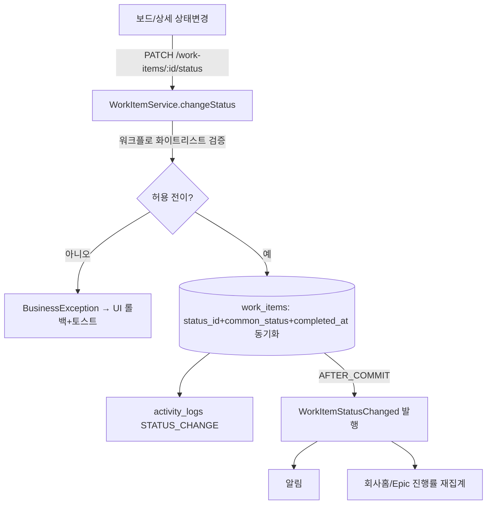

# WorkMap 실행 지시서 (execution-spec)

> 최종 수정: 2026-06-23 | 관련 CR: CR-006 (v0.4 Jira 전환)
> Claude Code 구현 진입점. 설계 내용을 복사하지 않고 각 산출물 경로를 참조한다.

---

## 0. 프로젝트 개요

- **WorkMap(업무지도)** — 당사 내부 업무를 **Jira 방식 애자일 구조(Epic/Story/Task/Bug/Sub-task)**로 모으고 Backlog·Sprint·Board·Timeline·회사홈으로 파생시키는 내부 업무운영 시스템.
- **프로젝트 유형**: 풀스택 (Spring Boot + React)
- **핵심 원칙**: **하나의 work_item 데이터, 여러 관점.** 백로그·보드·목록·타임라인·이슈는 별도 테이블이 아닌 work_item 단일 테이블의 파생 뷰(BIZ-106).
- **구현 범위**: Phase 1(Sprint 1~5, MVP 43기능). Phase 2~3은 청사진 보존.
- **정본 기획**: docs/origins/WorkMap_제품기획서_v0.4_Jira기반.md

---

## 1. 산출물 맵

| 산출물 | 경로 |
|--------|------|
| 원본 요구사항(v0.4 정본) | docs/origins/WorkMap_제품기획서_v0.4_Jira기반.md |
| Jira 화면 인벤토리 | docs/origins/WorkMap_Jira화면_인벤토리_v1.md |
| 기능 요구사항 | docs/T1-1_기능요구사항_명세서.md |
| 모듈 요약 | docs/T1-2_모듈_요약.md |
| 비즈니스 규칙 | docs/T1-3_비즈니스_규칙.md |
| 정책 정의 | docs/T1-4_정책_정의.md |
| FSM 상태 정의 | docs/T1-5_FSM_상태_정의.md |
| 이벤트 계약 | docs/T1-6_이벤트_계약.md |
| Sprint 구조도 | docs/T1-7_Sprint_구조도.md |
| 시스템 가이드 | docs/T1-8_시스템_가이드.md |
| 기술 스택 | docs/T2-1_기술스택_결정서.md |
| 데이터 모델 | docs/T3-1_데이터_모델.md |
| API 설계 | docs/T3-2_API_설계.md |
| 화면 구조(IA) | docs/T3-3_화면_구조.md |
| 단위테스트 명세 | docs/T3-5_단위테스트_명세.md |
| 변경 이력 | docs/CR_변경_이력.md |
| 프로젝트 지침 | CLAUDE.md (+ AI-SDLC_공통라이브러리_레퍼런스.md) |

---

## 2. 기술 스택 요약 (T2-1)

- **BE**: Java 17 + Spring Boot 3.x + **MyBatis** + **PostgreSQL 16** + Flyway. bp-common-lib 0.1.0(응답/예외/페이징/JWT/검색). 패키지 `com.therecommerce.workmap`. 에러코드 7700번대. **JPA 금지.**
- **FE**: React 19 + Vite + TS + @therecommerce/ds-ui(Tailwind v4) + TanStack Query + Zustand + React Hook Form/Zod. pnpm.
- **이벤트(Phase1)**: Spring ApplicationEvent(인프로세스, AFTER_COMMIT 비동기 알림).
- **레포**: 모노레포(`backend/` + `frontend/`). 포트 BE 8186 / FE 3186.

---

## 3. 모듈 총괄 (T1-2)

A.인증/사용자 · B.워크스페이스/프로젝트 · **C.업무 항목(Work Item, 핵심)** · D.애자일 실행(백로그/스프린트/보드) · E.운영 실행(칸반/처리량/개선루프) · F.보기(목록 분할뷰/타임라인/검색) · G.회사홈(막힘 중심)·보고 · H.관리자 설정(측정단위/필드스킴/워크플로 마스터) · I.알림. (총 51기능, MVP 43)

---

## 4. 데이터 모델 요약 (상세: T3-1)

- **핵심 단일 테이블 `work_items`**: Epic/Story/Task/Bug/Sub-task를 issue_type + parent_id(Sub-task 부모)/epic_id(Epic 연결)로 표현. 유형 고유 필드(acceptance_criteria/steps_to_reproduce/checklist 등)는 같은 테이블에 두고 화면 표시만 차등(BIZ-102).
- **마스터(하드코딩 금지, 시드 제공)**: issue_type, workflow/workflow_status/workflow_transition(FSM 화이트리스트), measure_unit(측정), field_scheme, project_template.
- **측정 추상화**: work_items.measure_unit_id/target_value/current_value → progress 자동(정량=현재÷목표, 정성=상태 기반).
- **애자일**: sprints(FUTURE→ACTIVE→COMPLETED), releases. work_items.sprint_id(백로그=null).
- `work_items.common_status`는 집계용 비정규화 — 상태 변경 시 트랜잭션 내 동기화. 소프트삭제 `deleted_at`(부분 인덱스). key는 projects.seq_counter로 채번.

---

## 5. Sprint별 참조 가이드

> 풀스택: 각 Sprint는 **BE 세션 → FE 세션** 순서 권장(5-B).

### Sprint 1 — 세팅
- 공통: T2-1 전체, CLAUDE.md, AI-SDLC_공통라이브러리_레퍼런스.md
- BE: bp-common-lib 연동(응답/예외/페이징/JWT/SecurityWhitelist 구현체, 7700 ErrorCode) + Flyway(V1 스키마 from T3-1, V2 시드: issue_type 5종/workflow 3종+상태+전이/measure_unit/project_template/field_scheme — T3-1 "Flyway 시드" 절)
- FE: Vite+React+TS, ds-ui 설치, React Router/Query/Zustand 골격, 글로벌 LNB(§9.1)
- 검증: `/actuator/health` 200, `pnpm dev`+`build`, flyway migrate 성공+시드 row

### Sprint 2 — 인증·워크스페이스·프로젝트·멤버
- BE: T3-2 §인증/사용자/워크스페이스/프로젝트/멤버, T3-1(users/departments/workspaces/projects/project_members), T3-5 AUTH/WS 케이스
- FE: T3-3 로그인/프로젝트 목록/프로젝트 생성(유형 프리셋)/멤버 초대
- 핵심: JWT 발급, 이메일 UNIQUE, 프로젝트 key 채번, **가시성 권한 필터(BIZ-108)**, 멤버만 담당자/멘션

### Sprint 3 — 업무 항목 코어
- BE: T3-2 §work_item/링크/댓글/첨부/활동, T3-1(work_items/work_item_links/comments/attachments/activity_logs), **T1-5 전체(FSM)**, T1-6(WorkItemCreated/Assigned/StatusChanged/Blocked/Mentioned/MeasureUpdated), T3-5 WI/FSM/측정/계층 케이스
- FE: T3-3 업무 상세(유형별 분기, 우측 접이식, +액션메뉴) + 만들기 모달(§9.4)
- 핵심: **work_item 단일 테이블 CRUD**, **계층 정합성(BIZ-103)**, **FSM 가드(BIZ-010)**, BLOCKED 사유(BIZ-005), 완료 자동(BIZ-006), **담당자 미배정 허용(BIZ-002 변경)**, **측정 progress(BIZ-105)**, 유형전환(WMP-WI-014)

### Sprint 4 — 애자일·운영 실행
- BE: T3-2 §백로그/스프린트/보드/운영, T3-1(sprints/releases), T1-5(sprint FSM + UI 드래그 FSM), T1-6(SprintStarted/SprintCompleted), T3-5 AGL/OPS/벌크 케이스
- FE: T3-3 백로그(스프린트 헤더·Epic 펼침 트리·인라인생성)/스크럼·칸반 보드/벌크편집. 드래그는 T1-5 UI FSM(낙관적+롤백)
- 핵심: 백로그↔스프린트 드래그, 스프린트 시작(앞 ACTIVE면 차단)/완료(이월), 보드 드래그→FSM, **벌크 편집(WMP-WI-015)**, 현장이슈→백로그(WMP-OPS-003)

### Sprint 5 — 보기·검색·회사홈·관리자·알림
- BE: T3-2 §보기/회사홈/관리자/알림, T3-1(notifications/saved_filters/forms), T3-5 VIEW/HOME/ADM/NOTI 케이스
- FE: T3-3 목록 분할뷰(§9.5)/검색·퀵필터/회사홈(막힘 중심)/관리자 마스터/알림·받은함
- 핵심: 표⇄분할 토글, 퀵필터(SearchCondition), **막힘 중심 대시보드(§9.2)**, 지연/막힘/미배정 집계(POL-002/003), 관리자 마스터 CRUD(측정단위/필드스킴/워크플로 편집기), 알림 발행/수신

### CR-018 — WS 격리 경계 + 진입감 IA (Phase1 설계 전환, 횡단)
> Sprint 2~5가 끝난 뒤 진행하는 **횡단 작업**. 기존 전역 화면들을 WS 컨텍스트로 격리·스코프. T1(WMP-WS-001/007/008·BIZ-108/112·POL-004)→T3(T3-1 workspace_members·T3-2 §C·T3-3 §9.1) 캐스케이드 완료본 기준.
- **BE (대규모, 본체)**:
  1. **V4 마이그레이션** — `workspace_members` 테이블 + 백필(기존 project_members → workspace 멤버 승격, workspace.created_by). 안 하면 기존 사용자 격리 차단됨.
  2. **WS 멤버 도메인** — WorkspaceMember 엔티티/Mapper/Service + `GET·POST·DELETE /workspaces/{id}/members`(전사 Admin 가드). `GET /workspaces`를 "내 WS만"으로 변경.
  3. **WS 격리 가드(BIZ-112)** — `/projects`·`/work-items`·`/search`·`/inbox`·`/dashboard/*` 전 목록 쿼리에 호출자 workspace_members 교집합 필터(서버 강제). 클라 wsId는 "더 좁히기"로만. 비멤버 wsId 위조 시 빈 결과/403. 가시성 2차(BIZ-108)는 1차 통과 후 적용.
  4. 에러코드 WMP-7803~7805(WORKSPACE_ACCESS_DENIED/MEMBER_NOT_FOUND/MEMBER_DUPLICATED). WS 미존재는 기존 WMP-7722 재사용.
- **FE**:
  1. `/select-workspace` 화면(WMP-WS-008) — 내 WS 카드, 0/1/다수 분기, localStorage 기억.
  2. LNB **WS 스위처**(맨 위) + 그 WS **프로젝트 상시 나열**(ⓐ, AppShell 개조). 프로젝트 진입 후 LNB 유지·상단 가로탭 유지.
  3. 홈·받은함·검색·프로젝트목록을 선택 WS 컨텍스트로. WS 멤버 관리 화면(`/workspaces/:wsId/members`, Admin).
- **테스트(T3-5 보강)**: WS 비멤버 격리(목록 0건/403), wsId 위조 방어, 2단 가시성(WS멤버∩PRIVATE), 백필 정합.
- **핵심 함정**: ① 백필 누락 시 기존 운영 사용자 전원 튕김(배포 전 필수). ② 가드를 클라 wsId만 믿으면 격리 무력화 — 반드시 서버 멤버십 교집합. ③ 회사홈 전사집계도 멤버 WS 범위(전 WS 무차별 금지, BIZ-112).

---

## 5-A. Sprint 완료 게이트

| # | 항목 | 확인 |
|---|------|------|
| G-1 | 단위테스트 통과 | `./gradlew test` / `pnpm test` |
| G-2 | BE POST Happy Path | 엔티티별 생성 201 |
| G-3 | FE 조작 UI 동작 | 목록만은 미완료 |
| G-4 | FE-BE 호출 성공 | 경로·필드·타입 일치 |
| G-5 | T1-7 검증 기준 확인 | 행별 확인 |
| G-6 | 미완료 명시 보고 | "M/N 완료. 미완료: …" |

---

## 5-B. 구현 세션 분리 전략

- **권장**: Sprint 단위 BE 세션 → FE 세션 분리(풀스택, 기능량 많음).
- BE 세션 시작 지시: "CLAUDE.md + execution-spec §해당Sprint(BE) + T3-1 + T3-2(해당 모듈) + T1-5/T1-6 + T3-5(해당) 읽고 BE 구현"
- FE 세션 시작 지시: "CLAUDE.md + execution-spec §해당Sprint(FE) + T3-3(해당 페이지) + 완성된 BE API(T3-2) 읽고 FE 구현. ds-ui 우선, 자체 composite는 WorkItemCard/KanbanBoard/BacklogRow/SprintHeader/StatusBadge/TypeBadge/MeasureBar/SplitView/CreateModal만"

---

## 5-C. Git 브랜치 전략

- `main`(보호) ← `develop` ← `feat/SPR-{N}-{기능}`
- 흐름: `feat/SPR-01-setup` → develop(PR) → main(릴리스 PR)+tag v2.0
- 커밋: `<type>: <설명>` (feat/fix/refactor/docs/chore/ui). 설계 문서(docs/)는 develop에 먼저 commit.

---

## 6. 핵심 아키텍처 원칙 (Quick Reference)

- 모든 work_item: **프로젝트 필수(BIZ-001)**. 담당자는 **권장이며 미배정 허용(BIZ-002, ★v0.4 변경)** — 미배정은 회사홈에서 강조.
- 계층 정합성만 시스템 강제(BIZ-103): Sub-task 부모 필수, Epic은 Sub-task 부모 불가, depth≤2. **워크플로 강제 금지(BIZ-104)** — Story 먼저 같은 순서 강요 안 함.
- 상태 전이: **워크플로 마스터 화이트리스트만(BIZ-010)**, BLOCKED 사유 필수(BIZ-005), DONE completed_at 자동(BIZ-006).
- 이슈/리스크/WBS/칸반/타임라인 = work_item 파생 뷰(BIZ-106) — 별도 테이블 금지.
- 유형별 필드 = 단일 테이블 + 화면 표시 차등(BIZ-102, 스키마 차등 없음).
- 측정단위·필드스킴·워크플로·업무유형 = 마스터 데이터, 하드코딩 금지(BIZ-107).
- 진행률 = 측정 기준(BIZ-105): 정량 현재÷목표, 정성 상태 기반.
- 비공개 프로젝트는 멤버만(BIZ-108). 이슈 링크 양방향 자동(BIZ-109).
- bp-common-lib 제공 영역 직접 구현 금지. JPA 금지.

---

## 7. Sprint 의존관계

---

## 8. 설계 리뷰 시트

### 데이터 흐름 (상태 변경 → 파생)

### 화면-API 매핑 (요약)
| 화면 | 주요 API |
|------|---------|
| 회사홈(막힘 중심) | GET /dashboard/{blocked,delayed,unassigned,metrics} |
| 백로그 | GET /projects/:key/backlog, POST /sprints/:id/start, /complete, PATCH /work-items/:id/sprint |
| 보드 | GET /projects/:key/board, PATCH /work-items/:id/status |
| 목록 분할뷰 | GET /work-items(검색·필터·퀵필터·페이징) |
| 업무 상세 | GET/PATCH /work-items/:id, /status, /assignee, /convert, /measure, links, comments, activities |
| 벌크 편집 | PATCH /work-items/bulk |
| 관리자 마스터 | /admin/{measure-units,field-schemes,workflows,issue-types,forms} |

---

## 9. 다음 단계 (구현 진입)

1. **설계 문서 develop 커밋** (이 CR-006 전면 개정분).
2. Sprint 1(세팅)부터 BE→FE 세션 분리로 진행.
3. 목업(frontend/)은 참고용 — 구현은 본 설계 기준. UI 디테일은 docs/origins/WorkMap_Jira화면_인벤토리_v1.md에 캡처가 누적되면 T3-3에 반영.
4. CLAUDE.md의 "현재 진행 상태"·"참조 문서"를 v0.4 기준으로 갱신(별도 작업).
