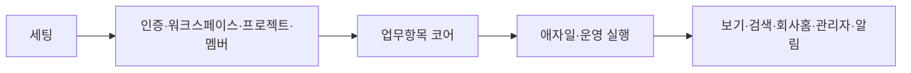
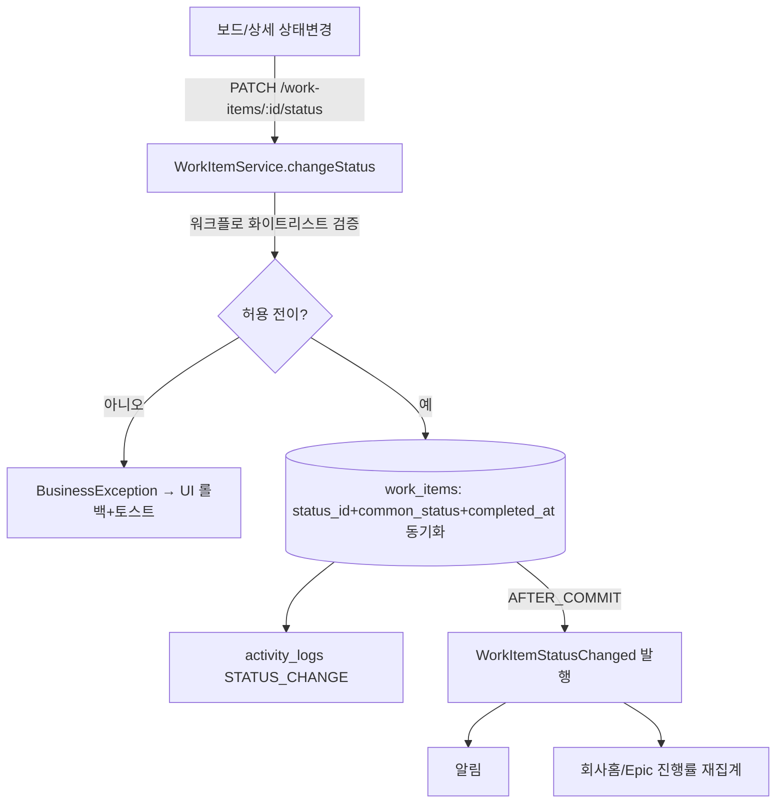

# WorkMap 실행 지시서 (execution-spec)

> 최종 수정: 2026-06-23 | 관련 CR: CR-006 (v0.4 Jira 전환)
> Claude Code 구현 진입점. 설계 내용을 복사하지 않고 각 산출물 경로를 참조한다.

---

## 0. 프로젝트 개요

- **WorkMap(업무지도)** — 당사 내부 업무를 **Jira 방식 애자일 구조(Epic/Story/Task/Bug/Sub-task)**로 모으고 Backlog·Sprint·Board·Timeline·회사홈으로 파생시키는 내부 업무운영 시스템.
- **프로젝트 유형**: 풀스택 (Spring Boot + React)
- **핵심 원칙**: **하나의 work_item 데이터, 여러 관점.** 백로그·보드·목록·타임라인·이슈는 별도 테이블이 아닌 work_item 단일 테이블의 파생 뷰(BIZ-106).
- **구현 범위**: Phase 1(Sprint 1~5, MVP 43기능). Phase 2~3은 청사진 보존.
- **정본 기획**: docs/origins/WorkMap_제품기획서_v0.4_Jira기반.md

---

## 1. 산출물 맵

| 산출물 | 경로 |
|--------|------|
| 원본 요구사항(v0.4 정본) | docs/origins/WorkMap_제품기획서_v0.4_Jira기반.md |
| Jira 화면 인벤토리 | docs/origins/WorkMap_Jira화면_인벤토리_v1.md |
| 기능 요구사항 | docs/T1-1_기능요구사항_명세서.md |
| 모듈 요약 | docs/T1-2_모듈_요약.md |
| 비즈니스 규칙 | docs/T1-3_비즈니스_규칙.md |
| 정책 정의 | docs/T1-4_정책_정의.md |
| FSM 상태 정의 | docs/T1-5_FSM_상태_정의.md |
| 이벤트 계약 | docs/T1-6_이벤트_계약.md |
| Sprint 구조도 | docs/T1-7_Sprint_구조도.md |
| 시스템 가이드 | docs/T1-8_시스템_가이드.md |
| 기술 스택 | docs/T2-1_기술스택_결정서.md |
| 데이터 모델 | docs/T3-1_데이터_모델.md |
| API 설계 | docs/T3-2_API_설계.md |
| 화면 구조(IA) | docs/T3-3_화면_구조.md |
| 단위테스트 명세 | docs/T3-5_단위테스트_명세.md |
| 변경 이력 | docs/CR_변경_이력.md |
| 프로젝트 지침 | CLAUDE.md (+ AI-SDLC_공통라이브러리_레퍼런스.md) |

---

## 2. 기술 스택 요약 (T2-1)

- **BE**: Java 17 + Spring Boot 3.x + **MyBatis** + **PostgreSQL 16** + Flyway. bp-common-lib 0.1.0(응답/예외/페이징/JWT/검색). 패키지 `com.therecommerce.workmap`. 에러코드 7700번대. **JPA 금지.**
- **FE**: React 19 + Vite + TS + @therecommerce/ds-ui(Tailwind v4) + TanStack Query + Zustand + React Hook Form/Zod. pnpm.
- **이벤트(Phase1)**: Spring ApplicationEvent(인프로세스, AFTER_COMMIT 비동기 알림).
- **레포**: 모노레포(`backend/` + `frontend/`). 포트 BE 8186 / FE 3186.

---

## 3. 모듈 총괄 (T1-2)

A.인증/사용자 · B.워크스페이스/프로젝트 · **C.업무 항목(Work Item, 핵심)** · D.애자일 실행(백로그/스프린트/보드) · E.운영 실행(칸반/처리량/개선루프) · F.보기(목록 분할뷰/타임라인/검색) · G.회사홈(막힘 중심)·보고 · H.관리자 설정(측정단위/필드스킴/워크플로 마스터) · I.알림. (총 51기능, MVP 43)

---

## 4. 데이터 모델 요약 (상세: T3-1)

- **핵심 단일 테이블 `work_items`**: Epic/Story/Task/Bug/Sub-task를 issue_type + parent_id(Sub-task 부모)/epic_id(Epic 연결)로 표현. 유형 고유 필드(acceptance_criteria/steps_to_reproduce/checklist 등)는 같은 테이블에 두고 화면 표시만 차등(BIZ-102).
- **마스터(하드코딩 금지, 시드 제공)**: issue_type, workflow/workflow_status/workflow_transition(FSM 화이트리스트), measure_unit(측정), field_scheme, project_template.
- **측정 추상화**: work_items.measure_unit_id/target_value/current_value → progress 자동(정량=현재÷목표, 정성=상태 기반).
- **애자일**: sprints(FUTURE→ACTIVE→COMPLETED), releases. work_items.sprint_id(백로그=null).
- `work_items.common_status`는 집계용 비정규화 — 상태 변경 시 트랜잭션 내 동기화. 소프트삭제 `deleted_at`(부분 인덱스). key는 projects.seq_counter로 채번.

---

## 5. Sprint별 참조 가이드

> 풀스택: 각 Sprint는 **BE 세션 → FE 세션** 순서 권장(5-B).

### Sprint 1 — 세팅
- 공통: T2-1 전체, CLAUDE.md, AI-SDLC_공통라이브러리_레퍼런스.md
- BE: bp-common-lib 연동(응답/예외/페이징/JWT/SecurityWhitelist 구현체, 7700 ErrorCode) + Flyway(V1 스키마 from T3-1, V2 시드: issue_type 5종/workflow 3종+상태+전이/measure_unit/project_template/field_scheme — T3-1 "Flyway 시드" 절)
- FE: Vite+React+TS, ds-ui 설치, React Router/Query/Zustand 골격, 글로벌 LNB(§9.1)
- 검증: `/actuator/health` 200, `pnpm dev`+`build`, flyway migrate 성공+시드 row

### Sprint 2 — 인증·워크스페이스·프로젝트·멤버
- BE: T3-2 §인증/사용자/워크스페이스/프로젝트/멤버, T3-1(users/departments/workspaces/projects/project_members), T3-5 AUTH/WS 케이스
- FE: T3-3 로그인/프로젝트 목록/프로젝트 생성(유형 프리셋)/멤버 초대
- 핵심: JWT 발급, 이메일 UNIQUE, 프로젝트 key 채번, **가시성 권한 필터(BIZ-108)**, 멤버만 담당자/멘션

### Sprint 3 — 업무 항목 코어
- BE: T3-2 §work_item/링크/댓글/첨부/활동, T3-1(work_items/work_item_links/comments/attachments/activity_logs), **T1-5 전체(FSM)**, T1-6(WorkItemCreated/Assigned/StatusChanged/Blocked/Mentioned/MeasureUpdated), T3-5 WI/FSM/측정/계층 케이스
- FE: T3-3 업무 상세(유형별 분기, 우측 접이식, +액션메뉴) + 만들기 모달(§9.4)
- 핵심: **work_item 단일 테이블 CRUD**, **계층 정합성(BIZ-103)**, **FSM 가드(BIZ-010)**, BLOCKED 사유(BIZ-005), 완료 자동(BIZ-006), **담당자 미배정 허용(BIZ-002 변경)**, **측정 progress(BIZ-105)**, 유형전환(WMP-WI-014)

### Sprint 4 — 애자일·운영 실행
- BE: T3-2 §백로그/스프린트/보드/운영, T3-1(sprints/releases), T1-5(sprint FSM + UI 드래그 FSM), T1-6(SprintStarted/SprintCompleted), T3-5 AGL/OPS/벌크 케이스
- FE: T3-3 백로그(스프린트 헤더·Epic 펼침 트리·인라인생성)/스크럼·칸반 보드/벌크편집. 드래그는 T1-5 UI FSM(낙관적+롤백)
- 핵심: 백로그↔스프린트 드래그, 스프린트 시작(앞 ACTIVE면 차단)/완료(이월), 보드 드래그→FSM, **벌크 편집(WMP-WI-015)**, 현장이슈→백로그(WMP-OPS-003)

### Sprint 5 — 보기·검색·회사홈·관리자·알림
- BE: T3-2 §보기/회사홈/관리자/알림, T3-1(notifications/saved_filters/forms), T3-5 VIEW/HOME/ADM/NOTI 케이스
- FE: T3-3 목록 분할뷰(§9.5)/검색·퀵필터/회사홈(막힘 중심)/관리자 마스터/알림·받은함
- 핵심: 표⇄분할 토글, 퀵필터(SearchCondition), **막힘 중심 대시보드(§9.2)**, 지연/막힘/미배정 집계(POL-002/003), 관리자 마스터 CRUD(측정단위/필드스킴/워크플로 편집기), 알림 발행/수신

### CR-018 — WS 격리 경계 + 진입감 IA (Phase1 설계 전환, 횡단)
> Sprint 2~5가 끝난 뒤 진행하는 **횡단 작업**. 기존 전역 화면들을 WS 컨텍스트로 격리·스코프. T1(WMP-WS-001/007/008·BIZ-108/112·POL-004)→T3(T3-1 workspace_members·T3-2 §C·T3-3 §9.1) 캐스케이드 완료본 기준.
- **BE (대규모, 본체)**:
  1. **V4 마이그레이션** — `workspace_members` 테이블 + 백필(기존 project_members → workspace 멤버 승격, workspace.created_by). 안 하면 기존 사용자 격리 차단됨.
  2. **WS 멤버 도메인** — WorkspaceMember 엔티티/Mapper/Service + `GET·POST·DELETE /workspaces/{id}/members`(전사 Admin 가드). `GET /workspaces`를 "내 WS만"으로 변경.
  3. **WS 격리 가드(BIZ-112)** — `/projects`·`/work-items`·`/search`·`/inbox`·`/dashboard/*` 전 목록 쿼리에 호출자 workspace_members 교집합 필터(서버 강제). 클라 wsId는 "더 좁히기"로만. 비멤버 wsId 위조 시 빈 결과/403. 가시성 2차(BIZ-108)는 1차 통과 후 적용.
  4. 에러코드 WMP-7803~7805(WORKSPACE_ACCESS_DENIED/MEMBER_NOT_FOUND/MEMBER_DUPLICATED). WS 미존재는 기존 WMP-7722 재사용.
- **FE**:
  1. `/select-workspace` 화면(WMP-WS-008) — 내 WS 카드, 0/1/다수 분기, localStorage 기억.
  2. LNB **WS 스위처**(맨 위) + 그 WS **프로젝트 상시 나열**(ⓐ, AppShell 개조). 프로젝트 진입 후 LNB 유지·상단 가로탭 유지.
  3. 홈·받은함·검색·프로젝트목록을 선택 WS 컨텍스트로. WS 멤버 관리 화면(`/workspaces/:wsId/members`, Admin).
- **테스트(T3-5 보강)**: WS 비멤버 격리(목록 0건/403), wsId 위조 방어, 2단 가시성(WS멤버∩PRIVATE), 백필 정합.
- **핵심 함정**: ① 백필 누락 시 기존 운영 사용자 전원 튕김(배포 전 필수). ② 가드를 클라 wsId만 믿으면 격리 무력화 — 반드시 서버 멤버십 교집합. ③ 회사홈 전사집계도 멤버 WS 범위(전 WS 무차별 금지, BIZ-112).

### CR-027 — 이메일 초대 가입 + 비밀번호 재설정/변경 (인증번호 OTP, 횡단)
> 가입 경로를 "관리자 직접 비밀번호 지정"에서 "이메일 인증번호 초대"로 전환하고, 비밀번호 분실재설정·로그인상태 변경을 추가한다. T1(WMP-AUTH-004/006/007/008/009·POL-012/013·UserInvited/UserJoined/PasswordChanged)→T3(T3-1 invitations·email_otp / T3-2 §A·§B / T3-3 신규 3화면) 캐스케이드 완료본 기준. **users 스키마 무변경.**
- **사전 작업 (bp-notification 연동, 1회성)**:
  1. bp-notification 관리자 API로 WorkMap을 솔루션 등록 — `POST http://59.8.160.12:8185/api/v1/admin/solutions`(Basic Auth) body `{solutionCode:"WMP", solutionName:"WorkMap", allowedServices:"EMAIL", ...}` → 응답의 **apiKey 1회 확보**(재조회 불가).
  2. 인증번호 이메일 템플릿 3종 등록 — `POST /api/v1/admin/templates`(messageType=EMAIL): `WMP_INVITE_OTP`(초대), `WMP_RESET_OTP`(분실), `WMP_CHANGE_OTP`(변경). content/contentHtml에 `{{code}}`·`{{expiresMin}}`·`{{name}}` 변수. 발송 시 WorkMap이 templateCode+variables로 호출.
  3. WorkMap 설정 주입 — `workmap.notification.base-url=http://59.8.160.12:8185`, `workmap.notification.api-key=${WMP_NOTI_API_KEY}`(운영 docker env), `workmap.auth.otp.*`(만료10분/시도5/쿨다운60s).
- **BE (대규모)**:
  1. **V9 마이그레이션** — `invitations`·`email_otp` 테이블(T3-1). invitations 부분 유니크(PENDING email). 시드 불요. (CR-027 구현이 V9를 점유 — 작업트리에 `V9__invitations_email_otp.sql` 확인됨.)
  2. **신규 모듈 `auth` 확장 + `invitation` 모듈** — 도메인(Invitation·EmailOtp)/Mapper/Service. `OtpService`(발급·해시저장·검증·시도카운트·쿨다운·소비), `InvitationService`(초대 생성→OTP 발급→발송, 수락→OTP 검증→UserService.create 위임→ACCEPTED), `PasswordService`(forgot/reset/change). 비밀번호 인코딩은 기존 `UserService`/`PasswordEncoder` 재사용.
  3. **`NotificationClient`** — bp-notification `POST /messages/email` 호출(`X-API-Key`). best-effort(발송 실패가 OTP 발급 트랜잭션 롤백 금지, 실패 로깅). RestClient/WebClient.
  4. **컨트롤러** — `AuthController`에 accept/forgot/reset/change/change-request-otp 5종(공개 경로는 SecurityWhitelist에 추가: `/api/v1/auth/invitations/accept`·`/auth/password/forgot`·`/auth/password/reset`). `InvitationController`(`/api/v1/invitations` Admin 가드).
  5. **에러코드 WMP-7829~** (아래 §에러코드). 신규 매퍼는 기존 `@WebMvcTest`(User/Project/WorkItem ControllerTest)에 `@MockBean` 동반 등록(CR-009 함정).
- **FE (중규모)**:
  1. 공개 라우트 신규 — `/invite/accept`·`/password/forgot`(RequireAuth 밖). `/account/password`(RequireAuth 안). `features/auth/` api·hooks 확장(accept/forgot/reset/change).
  2. 화면 3종(T3-3): 초대 수락 카드, 비밀번호 찾기 단계형, 비밀번호 변경(헤더 계정 메뉴 진입). 모두 ds-ui only(네이티브 alert/select/input date 금지), primary 저장 버튼, 인라인 에러=공통 Alert, 인증번호 재발송 쿨다운 표시.
  3. 로그인 화면에 "비밀번호를 잊으셨나요?" 링크. 관리자 사용자 화면의 "사용자 생성"을 "초대"로 — `POST /invitations` 연결, 초대 목록/재발송/취소.
- **테스트(T3-5 보강)**: OTP 발급·검증(만료/시도5초과/소비후 재사용 거부/쿨다운), 초대 수락→user 생성·중복 PENDING 거부, forgot 계정열거 방지(미존재도 200·발송無), change 현재PW 불일치 거부·동일PW 거부. NotificationClient는 Mock.
- **핵심 함정**: ① 공개 경로 SecurityWhitelist 누락 시 accept/forgot 403(CR-007 v1 prefix 규칙). ② 인증번호 평문을 응답/로그에 노출 금지(해시 저장). ③ bp-notification apiKey는 1회 응답이라 분실 시 재발급 — 운영 env에 보관. ④ 발송 실패가 OTP 트랜잭션 막으면 사용자 가입 불가 — best-effort. ⑤ users.password_hash 불변식 — 초대 단계 user 미생성, 수락 시점 생성.
- **에러코드 WMP-7829~** (7820~7828 채팅 점유, 다음 빈 번호):
  - WMP-7829 INVITATION_NOT_FOUND(404) / WMP-7830 INVITATION_ALREADY_ACCEPTED(409) / WMP-7831 INVITATION_EXPIRED(410) / WMP-7832 INVITATION_PENDING_DUPLICATED(409, 이미 PENDING 초대 존재)
  - WMP-7833 OTP_NOT_FOUND(404) / WMP-7834 OTP_EXPIRED(410) / WMP-7835 OTP_MISMATCH(400) / WMP-7836 OTP_ATTEMPTS_EXCEEDED(429) / WMP-7837 OTP_RESEND_COOLDOWN(429)
  - WMP-7838 PASSWORD_SAME_AS_CURRENT(400). (현재PW 불일치=기존 WMP-7742 INVALID_CREDENTIALS, 이메일 중복=기존 WMP-7741 재사용)

### CR-028 — 각종 알림 확장: 트리거 발행 구현 + 외부 채널(bp-notification) + 수신 설정 (횡단)
> 기존 알림(배정/멘션/막힘 3종·인앱 받은함)을 ① T1-6 선정의 이벤트의 **발행 구현**(댓글·상태변경·마감임박/초과·스프린트·승인) ② **외부 전달**(이메일/푸시, bp-notification) ③ **사용자 수신 설정**(종류×채널 on/off)으로 확장. T1(WMP-NOTI-001~005·POL-009 확장·WorkItemCommented)→T3(T3-1 notification_preferences·fcm_tokens / T3-2 §L / T3-3 `/account/notifications`) 캐스케이드 완료본 기준. **notifications 테이블 무변경(type는 VARCHAR(40) 그대로).**
- **사전 작업 (bp-notification 연동)**:
  - **CR-027과 솔루션 공유** — WorkMap 솔루션(solutionCode `WMP`)·apiKey·`workmap.notification.*` env가 CR-027에서 이미 등록됐으면 **재사용**. 미등록(CR-027 미구현)이면 CR-027 사전작업 1·3을 먼저 수행해 apiKey 확보(EMAIL + PUSH 서비스 허용). ⚠️ 솔루션 등록은 1회 — 중복 등록 금지.
  - **알림 템플릿 등록** — `POST /api/v1/admin/templates`로 종류별 템플릿. EMAIL: `WMP_NOTI_ASSIGNED`/`_BLOCKED`/`_MENTIONED`/`_COMMENTED`/`_STATUS_CHANGED`/`_DUE_APPROACHING`/`_OVERDUE`/`_SPRINT_STARTED`/`_SPRINT_COMPLETED`/`_APPROVAL_REQUESTED`/`_APPROVAL_DECIDED`. PUSH: 동일 코드(messageType=PUSH). 변수 `{{title}}`·`{{projectName}}`·`{{actorName}}`·`{{link}}`. (운영 빈도 낮은 종류는 1차에 핵심 5종만 등록, 미등록 종류는 외부발송 스킵+인앱만 — 가이드대로 점진 등록 가능.)
- **BE (대규모)**:
  1. **V10 마이그레이션** — `notification_preferences`·`fcm_tokens`(T3-1). UNIQUE 제약. 시드 불요. (V9는 CR-027 invitations·email_otp 점유 — 작업트리 확인됨. 구현 착수 시 미적용 마이그레이션 최대 번호 재확인 후 부여.)
  2. **NotificationType enum 확장** — 기존(ASSIGNED/MENTIONED/OVERDUE/BLOCKED/DUE_APPROACHING)에 COMMENTED/STATUS_CHANGED/SPRINT_STARTED/SPRINT_COMPLETED/APPROVAL_REQUESTED/APPROVAL_DECIDED 추가. (notifications.type=VARCHAR라 DB 무변경.)
  3. **`NotificationDispatcher`(신규)** — 단일 진입점. `create(recipientId, type, workItemId, message)` → ① `notifications` insert(인앱 원장, 항상) ② `notification_preferences` 조회(없으면 기본값) ③ email/push ON인 채널만 `NotificationGatewayClient` 호출. 기존 `NotificationEventListener`가 `NotificationService.create` 직접 호출하던 것을 Dispatcher 경유로 전환.
  4. **외부 클라이언트 = CR-027 `NotificationClient` 공유·확장**(신규 생성 금지). ⚠️ **실측(2026-06-29): CR-027 진행 중 작업트리에 이미 존재** — `invitation/service/NotificationClient.java`(`sendEmail()` only, `POST /messages/email`, `X-API-Key`) + `invitation/config/NotificationProperties.java`(baseUrl·apiKey·enabled). CR-028은 여기에 **`sendPush()`(`POST /messages/push`)·`registerFcmToken()`(`POST /fcm/token`)·`deleteFcmToken()`을 추가**하고 공용 위치(`integration/` 또는 `notification/`)로 이전. `@Async`+try/catch best-effort. **이 단계는 CR-027 커밋 이후에 착수**(미커밋 같은 파일 충돌 회피 — 아래 구현 순서 참조).
  - **구현 순서(CR-027 동시 진행 대응)**: CR-028을 두 갈래로 분할한다.
    - **(A) 지금 착수 — CR-027과 파일 무충돌**: NotificationType enum 확장 / NotificationDispatcher(외부 fan-out 지점은 인터페이스 주입, 미배선 시 no-op) / 신규 리스너 / 마감 스케줄러 / V10 테이블·매퍼 / 수신설정·FCM 컨트롤러 / FE 알림설정 화면 / 에러코드 7839~7841.
    - **(B) CR-027 커밋 후 착수 — 공유 자원**: `NotificationClient`에 push/fcm 메서드 추가 + 공용 이전 / `NotificationProperties` 재사용 / `application.yml`에 `workmap.notification.*` 블록(CR-027이 안 깔았으면 CR-028이 추가). Dispatcher의 no-op 외부 fan-out 자리에 클라이언트 주입.
  5. **신규 리스너/발행** — 기존 `NotificationEventListener`에 onCommented(WorkItemCommented)·onStatusChanged·onSprintStarted/Completed·onApprovalRequested/Decided 추가. `CommentService`에 멘션 없는 댓글이면 `WorkItemCommented` 발행(멘션이면 기존 Mentioned만 — 중복 금지). 본인이 단 댓글·본인 상태변경은 발행 스킵.
  6. **마감 스케줄러(WMP-NOTI-005)** — `@Scheduled` cron(매일 오전, CR-012 `@EnableScheduling` 재사용). 미완료 work_item due_date 스캔 → 임박(≤ `notify.due-soon-days`)/초과(< today) → WorkItemDueApproaching/Overdue 발행. **중복 방지**: 같은 work_item·type·날짜 1회(notifications 당일 동일 type 존재 체크 또는 별도 dedup).
  7. **컨트롤러** — `NotificationPreferenceController`(`GET`·`PUT /notification-preferences`, 본인만), `FcmTokenController`(`POST`·`DELETE /fcm/token`, 본인만). 신규 매퍼(NotificationPreferenceMapper·FcmTokenMapper)는 기존 `@WebMvcTest`(User/Project/WorkItem ControllerTest)에 `@MockBean` 동반 등록(CR-009 함정).
  8. **에러코드 WMP-7839~**(아래 §). 7829~7838은 CR-027 예약이라 침범 금지.
- **FE (중규모)**:
  1. `/account/notifications` 라우트 신규(RequireAuth 안) + `features/notification-pref/`(또는 inbox 확장) api·hooks. 매트릭스 화면(행=종류, 열=인앱/이메일/푸시 `Switch`).
  2. 받은함 헤더에 [알림 설정] 진입. FCM 토큰 등록 — 로그인 성공 훅에서 브라우저 알림 권한 요청→토큰 `POST /fcm/token`, 로그아웃 훅에서 `DELETE`. (웹푸시 Service Worker·VAPID는 FE 인프라 — 1차엔 토큰 등록 배선만, 실제 SW 등록은 후속 가능. 미배선이면 푸시 열 비활성.)
  3. ds-ui only(Switch/Table/Toast), 저장=primary, 인라인 알림=공통 Alert, 로딩=스켈레톤.
- **테스트(T3-5 보강)**: Dispatcher(설정 없으면 기본값·인앱 항상·email OFF면 외부 호출 안 함·ON이면 호출), 신규 리스너 발행 여부+페이로드(본인 액션 스킵 검증), 스케줄러(임박/초과 판정·완료 제외·당일 중복 방지·담당자 없음 스킵), preferences upsert(부분 갱신·본인만), GatewayClient는 Mock(발송 실패가 인앱 기록 안 막음).
- **핵심 함정**: ① bp-notification 솔루션 중복 등록 금지(CR-027과 공유). ② 외부 발송 best-effort — `@Async`+try/catch, 실패가 트랜잭션/인앱 막으면 안 됨. ③ 본인 액션 자기 알림 방지(자기 댓글/자기 상태변경/자기 배정). ④ 스케줄러 당일 중복 발행 방지. ⑤ in_app=false여도 받은함 원장 기록은 유지(표시만 제어). ⑥ 신규 매퍼 `@WebMvcTest` `@MockBean` 누락 시 컨텍스트 로딩 실패(CR-009). ⑦ V9는 CR-027(invitations·email_otp) 점유 — CR-028은 V10.
- **에러코드 WMP-7839~** (7829~7838 CR-027 예약, 다음 빈 번호):
  - WMP-7839 NOTIFICATION_PREFERENCE_INVALID_TYPE(400, 미지원 type) / WMP-7840 FCM_TOKEN_REQUIRED(400)
  - ⚠️ **실측 정정(2026-06-29)**: NOTIFICATION_NOT_FOUND·NOTIFICATION_FORBIDDEN은 **기존 7760·7761로 이미 존재**(NotificationService 사용 중) — 신규 채번하지 않고 재사용. 따라서 CR-028 신규는 위 2종(7839·7840)만.
  - (외부 발송 실패는 에러코드 아님 — best-effort 로깅. 수신 설정 조회/갱신 권한 위반은 기존 인증가드.)

---

### CR-029 — 모바일 앱(Capacitor 래핑): App Shell 구현 + 푸시/카메라/음성 설계 선기재 (FE 인프라)
> 현재 React/Vite FE를 **Capacitor**로 래핑해 iOS/Android 네이티브 앱으로 제공한다. T1(WMP-APP-001~004) 캐스케이드 기준. **CR-029 범위 = WMP-APP-001(App Shell)만 구현**, 002~004(푸시/카메라/음성)는 설계 선기재·구현은 후속 CR. **BE 변경 0**(기존 API·FCM 엔드포인트 그대로 사용). 참고 구현: `dev-labs/bp-issues-front`(동일 조직 Capacitor 8 패턴 — `capacitor.config.ts`·`usePushNotifications` 훅 실측 참조).
- **사전 확인(실측 완료 2026-06-29)**:
  - BE `POST·DELETE /api/v1/fcm/token` **이미 존재**(CR-028, `notification/controller/FcmTokenController.java` 실측). 푸시 구현 시 BE 추가 0.
  - FE `features/notification-pref/api.ts`에 `registerFcmToken`/`deleteFcmToken` **이미 존재(호출처 없음=미배선)**. Capacitor 푸시 도입 시 훅에서 호출만 연결.
  - 빌드 산출물 `frontend/dist` = Capacitor `webDir` 그대로 사용 가능.
- **FE — App Shell (중규모, CR-029 구현 범위)**:
  1. **의존성 추가**(frontend): `@capacitor/core` `@capacitor/cli`(dev) `@capacitor/ios` `@capacitor/android`. **푸시/카메라/음성 플러그인은 추가하지 않는다**(후속 CR). 버전은 bp-issues-front(8.x) 참조하되 우리 Vite/React 19와 호환 최신.
  2. **`capacitor.config.ts`**(frontend 루트): `appId='com.therecommerce.workmap'`, `appName='WorkMap'`, `webDir='dist'`, `server.allowNavigation=['59.8.160.12']`(운영 BE 호스트), SplashScreen 플러그인 설정(bp-issues 패턴 — backgroundColor는 WorkMap 톤). cleartext는 운영이 http(8186)라 필요(HTTPS 전환 시 제거).
  3. **API base URL — 운영 BE 절대경로 고정**: 앱은 dev 프록시(`/api`)가 없으므로 `api-client`의 baseURL이 네이티브에서 `http://59.8.160.12:8186`을 향하도록 분기. `Capacitor.isNativePlatform()`로 판별하거나 `build:mobile` 모드 env(`VITE_API_BASE`)로 주입. **웹 빌드는 기존 동작 유지**(상대경로/프록시).
  4. **package.json 스크립트**(bp-issues 패턴): `build:mobile`(=tsc -b && vite build), `sync`/`sync:ios`/`sync:android`(build:mobile && cap sync), `open:ios`/`open:android`.
  5. **플랫폼 생성**: `npx cap add ios && npx cap add android` → `ios/`·`android/` 디렉토리 생성. **.gitignore 점검** — 생성 네이티브 폴더 중 빌드 산출물(Pods/build/.gradle)은 무시, 설정(`capacitor.config.ts`·플랫폼 프로젝트 파일)은 커밋.
  6. **기동 확인**: `npm run sync:ios && npm run open:ios`(Xcode 시뮬레이터), android 동일(Android Studio 에뮬레이터). 운영 BE로 로그인→화면 렌더까지 확인.
- **모바일 레이아웃 점검(App Shell 후속, 같은 CR 가능)**: ds-ui `AdminShell`이 좁은 폭(폰)에서 LNB를 햄버거/드로어로 접는지 시뮬레이터에서 실측. **부족하면** 모바일 하단 탭바 등 보강(별도 판단 — 과하면 후속 CR). ⚠️ [[workmap-tailwind-lnb-trap]] — FE 라이브러리 추가 시 Tailwind v4 유틸 정렬 변동으로 `hidden md:block` 사이드바가 깨질 수 있음. Capacitor 의존 추가 후 **데스크탑 웹 LNB도 재확인**.
- **WMP-APP-002 푸시 (설계만 — 후속 CR 구현 가이드)**:
  - `@capacitor/push-notifications` 추가 → `usePushNotifications(userId)` 훅(bp-issues `src/hooks/usePushNotifications.ts` 이식): 권한 요청→register→`registration` 리스너에서 토큰을 **기존** `registerFcmToken({fcmToken, deviceInfo})` 호출(중복 토큰 스킵), `pushNotificationReceived`=ds-ui Toast, `pushNotificationActionPerformed`=알림 data로 딥링크(workItemId→업무 상세). 로그아웃 시 `deleteFcmToken`.
  - **선행 인프라(현재 미보유)**: Firebase 프로젝트, Android `google-services.json`, iOS APNs 키 + `GoogleService-Info.plist`. bp-notification 푸시 발송(`/messages/push`)은 CR-028 `BpNotificationGateway`가 이미 담당 — userId 기반 발송 경로 준비됨.
- **WMP-APP-003 카메라 (설계만)**: `@capacitor/camera` → 촬영/갤러리 → **기존** `POST /api/v1/files/upload`(CR-024, image 4종·10MB·서빙 화이트리스트 재사용, BE 0) → 첨부(WMP-WI-012)/리치에디터 삽입. 웹은 기존 `<input>` 업로드 유지(네이티브 가드 분기).
- **WMP-APP-004 음성 (설계만)**: 녹음=커뮤니티 플러그인(`capacitor-voice-recorder` 등)→파일 업로드. STT(받아쓰기)=OS 네이티브 STT 또는 BE STT 연동(범위·언어·온오프라인 후속 설계 확정). iOS/Android STT 차이 점검 필요.
- **핵심 함정**: ① 앱은 dev 프록시 없음 → API 절대 URL 필수(상대경로면 앱에서 요청 실패). ② cleartext http — 운영이 8186 http라 `allowNavigation`+`cleartext` 필요, HTTPS 전환 시 정리. ③ FE 의존 추가 후 Tailwind LNB 트랩 재확인([[workmap-tailwind-lnb-trap]]). ④ 푸시/카메라/음성 플러그인을 App Shell 단계에 섞지 말 것(범위 분리·빌드 단순 유지). ⑤ 네이티브 폴더 .gitignore 정합(산출물 무시·설정 커밋). ⑥ ds-ui 네이티브 위젯 금지 규칙은 앱에서도 동일(웹뷰라 동일 컴포넌트).
- **에러코드**: 신규 없음(App Shell은 클라 패키징 — BE/API 무변경).

---

### CR-035 — 타임라인 간트 고도화 (SVAR React Gantt: 드래그·의존성선·크리티컬패스)
> 자체 div 타임라인(`features/view/TimelineChart.tsx`)을 **SVAR React Gantt(MIT)** 기반으로 교체해 Jira 로드맵 수준으로 고도화. T1(WMP-VIEW-005/006) 캐스케이드 기준. **정공법 2결정**: ① 크리티컬패스=FE 순수함수 자체계산 ② 의존성 링크=timeline 응답 links[] 병기. **스키마·에러코드·마이그레이션 0**(work_item_links 기존 재사용).
- **사전 확인(실측 완료 2026-07-04)**:
  - 링크 데이터 존재: `work_item_links`(link_type BLOCKS/BLOCKED_BY/RELATES_TO/DUPLICATES, `WorkItemLinkService` 양방향 저장 BIZ-109). BLOCKS/BLOCKED_BY가 크리티컬패스 방향성 엣지.
  - 막대 드래그 저장 = **기존 `PATCH /work-items/{id}`(startDate/dueDate) 재사용** — 신규 엔드포인트 0. VIEWER는 CR-031 가드로 이미 쓰기 403.
  - 현 `timeline-util.ts`는 순수함수+단위테스트 패턴 → `criticalPath()` 얹기 자연스러움.
  - SVAR 실측 데이터 모델(2.7.x): task=`{id,text,start:Date,end:Date,progress(0~100),parent,type:'summary'|'task'}`, link=`{source,target,type:'e2s'|'s2s'|'e2e'|'s2e'}`, 드래그 이벤트=`api.on("update-task",({id,task,inProgress})=>…)`, 읽기전용=`readonly` prop, CSS=`import "@svar-ui/react-gantt/all.css"` + `<Willow>`/`<WillowDark>` + `--wx-gantt-*` 변수. **마커(오늘선)·크리티컬패스·스프린트밴드는 PRO 유료** → 자체 오버레이/FE계산으로 대체.
- **BE (소규모 — 응답 확장만)**:
  1. `ViewDtos`에 `TimelineLink(Long sourceId, Long targetId, String linkType)` record + `TimelineResponse`에 `List<TimelineLink> links` 필드 추가.
  2. `ViewMapper.timelineLinks(projectId)` 신규 select — `work_item_links l JOIN work_items s ON l.source_id=s.id JOIN work_items t ON l.target_id=t.id WHERE s.project_id=#{id} AND l.link_type='BLOCKS' AND s.deleted_at IS NULL AND t.deleted_at IS NULL`. (BLOCKS만=중복 제거, 화살표 1개).
  3. `ViewService.timeline`이 items + timelineLinks 조합해 반환. 가시성 가드(BIZ-108) 기존 로직 유지.
  4. 단위테스트: `ViewServiceTest`에 링크 병기·BLOCKS만 반환 검증. Mapper 통합테스트는 선택.
- **FE (대규모 — 화면 전면 교체)**:
  1. **의존성 추가**(frontend): `@svar-ui/react-gantt`(2.7.x). ⚠️ 추가 후 **Tailwind v4 LNB 재확인**([[workmap-tailwind-lnb-trap]]) — 빌드+배포 후 데스크탑 사이드바 확인 필수.
  2. `features/view/api.ts`: `TimelineLink` 타입 + `TimelineResponse.links` 추가.
  3. `timeline-util.ts`: `criticalPath(items, links)` 순수함수 신규 — 위상정렬(BLOCKS 방향) + 최장경로(막대 길이 가중). 순환/빈 그래프/일정없음 방어. + work_item→SVAR task 매핑, link→SVAR link 매핑 헬퍼. **단위테스트 필수**(허용경로·순환·빈그래프·단일노드).
  4. `TimelineChart.tsx` 교체: SVAR `<Gantt>` 래핑. `init`에서 `api.on("update-task",({id,task,inProgress})=>{ if(!inProgress) mutate PATCH })`. 낙관적 업데이트+실패 시 invalidate 롤백. VIEWER=`readonly`. 크리티컬패스 강조(막대/링크 클래스). 좌측 그리드 column `cell`에 ds-ui TypeBadge/StatusBadge.
  5. **자체 오버레이 레이어**: 오늘 세로선 + 스프린트 기간 배경 밴드를 간트 컨테이너 위 absolute로(시간축 스케일 공유). 기존 자체 타임라인 오늘선 기능 후퇴 방지.
  6. **테마 매핑**: `all.css` import + `--wx-gantt-*`를 ds-ui 토큰(중립·상태 신호색)으로 오버라이드(색 절제 규칙). 다크 = `<WillowDark>`.
  7. 기존 유지: 4단위 토글·에픽 필터·에픽 WBS 트리(SVAR summary/parent로 이관).
- **핵심 함정**: ① SVAR 막대 내부 커스텀 렌더 API 미확인 → 설치 후 검증(안 되면 막대 색 신호만, 뱃지는 좌측 그리드). ② 오늘선/스프린트밴드 자체 오버레이 = 무료 코어 마커 부재 대체(정합 주의). ③ `update-task`의 `inProgress` 가드 필수(드래그 중 프레임마다 PATCH 치면 과부하). ④ Tailwind v4 LNB 트랩([[workmap-tailwind-lnb-trap]]) — 배포 후 사이드바 재확인. ⑤ 링크 양방향 저장이라 timeline은 BLOCKS만(중복 화살표 방지). ⑥ 드래그 저장은 FSM 무관(날짜는 상태 아님)이나 VIEWER 가드는 CR-031로 이중 방어.
- **에러코드·마이그레이션**: 신규 없음(응답 형태 확장만, 스키마 무변경).

### CR-039 — 병렬 스프린트 + 보드 스프린트별 아코디언 (SPR-1 폐기)
> Jira처럼 한 프로젝트에 여러 스프린트 동시 진행 + 보드를 ACTIVE 스프린트별 아코디언으로 세로 표시. T1-5(sprint 규칙)·T3-2 §G(보드 응답)·T3-3(보드 화면) 캐스케이드 기준.
- **BE (중규모)**:
  - `SprintService.start`: **SPR-1 가드 삭제**(`findActiveByProject` + `ACTIVE_SPRINT_EXISTS` 던지는 블록 제거). FUTURE→ACTIVE만 검사, 앞 ACTIVE 존재는 허용.
  - `SprintMapper.findAllActiveByProject`(신규 XML): `WHERE project_id=? AND status='ACTIVE' ORDER BY id`.
  - `BoardDtos`: `BoardResponse`를 `{projectId, workflowId, List<SprintGroup> groups}`로, `SprintGroup{Long sprintId, String sprintName, LocalDate startDate, LocalDate endDate, List<Column> columns}` 신규. 단수 `sprintId` 필드 제거.
  - `BoardService.board`: ACTIVE 목록 순회 → 각 스프린트 항목(`findBySprint`)을 상태 컬럼으로 버킷 → 그룹 1개. ACTIVE 0개면 `findByProjectAndSprint(projectId, null, true)`(백로그 제외 전체)로 `sprintId=null·sprintName=null` 그룹 1개. **컬럼 버킷 로직은 그룹별로 반복**(기존 단일 로직을 헬퍼로 추출).
- **FE (중규모)**:
  - `board/api.ts` `BoardResponse`를 `groups: BoardGroup[]`로. `BoardGroup{sprintId, sprintName, startDate, endDate, columns}`.
  - `BoardView`: `groups` 순회 → 스프린트별 `BoardAccordionSection`(ds-ui `Collapsible`/`CollapsibleTrigger`/`CollapsibleContent`, 기본 전부 펼침). 헤더 = `sprintName · 기간 · 항목수`. 운영형(그룹1·`sprintName==null`)은 헤더 없이 `KanbanBoard`만.
  - `KanbanBoard`: 현재 `board:BoardResponse`를 받는 시그니처 → `columns:BoardColumn[] + projectId + groupKey`로 조정(그룹별 독립 DnD 컨텍스트). `cardById`/드롭 로직은 그룹 columns 기준.
- **핵심 함정**: ① 보드 응답 구조가 바뀌므로 **BE·FE 동시 배포 필수**(단수 sprintId 참조하던 FE EmptyState 문구 등 정리). ② 각 스프린트 섹션은 **독립 DnDContext** — 하나의 DnD로 전 그룹 묶으면 섹션 간 드롭이 의미 없어지고 statusId 충돌(같은 워크플로라 statusId 동일). ③ 운영형(ACTIVE 0)에서 아코디언 헤더 노출 금지(기존 단일 보드 UX 보존). ④ Tailwind v4 LNB 트랩([[workmap-tailwind-lnb-trap]]) — Collapsible 추가 후 배포 시 사이드바 재확인.
- **에러코드·마이그레이션**: 신규 없음(스키마 무변경, `ACTIVE_SPRINT_EXISTS` 코드는 잔존해도 미사용·무해).

### CR-043(배치) — 건강지표 요약 화면 노출 (링 + axes 칩)
> CR-043 지표 카탈로그는 구현 완료(보고서 [건강]탭). 이 항목은 **세 화면 배치(IA) 확정 후 요약 화면에 신호만 얹는** 후속 배치 작업. 기준 = T3-3 "건강지표 화면 배치 지도(IA)" + T1-1 WMP-HOME-004 화면 배치.
- **A. 요약 링 + axes 칩 (이번 범위, 중규모, BE 0)**:
  - `HealthDashboard`의 상단 종합 판정 블록(score-ring + verdict + axes 칩, 현재 `HealthDashboard.tsx` 62~82줄)을 **공통 컴포넌트로 추출**(예: `features/metrics/components/HealthSummaryStrip.tsx`) → 보고서·요약 양쪽에서 재사용.
  - `SummaryView.tsx`: 최상단에 `HealthSummaryStrip`(`useHealth(projectId)` 재사용) 배치. axes 칩 클릭 → `/projects/:key/reports`(기본 [건강]탭)로 이동(가능하면 해당 축으로 스크롤/포커스, 최소 탭 진입). 기존 4카드+진행률은 **유지**(대체 아님).
  - **BE·API·스키마·에러코드 변경 없음** — `GET /projects/{id}/health` 그대로 재사용.
- **B. 회사홈 프로젝트별 미니 링 (별도 트랙, 미구현)**: 전사/WS 건강 집계 API 신규(`/health`는 프로젝트 단건뿐) + WS IA 재편 얽힘 → 이번 범위 밖. 착수 시 재판단.
- **핵심 함정**: ① 요약은 **신호만** — 예외축 상세 카드·차트를 복제하지 말 것(경계 붕괴). ② 공통 컴포넌트 추출 시 보고서 [건강]탭 상단이 회귀 없이 동일 렌더되는지 확인. ③ Tailwind v4 LNB 트랙([[workmap-tailwind-lnb-trap]]) — 요약 화면 변경 배포 후 사이드바 재확인.

### CR-046 — 설정 3계층 IA 재편 + WS 설정 화면 + WS 보관 (횡단, 대규모)
> 배경: 전역 시스템 설정(`/admin/*`)이 WS 컨텍스트 셸에 갇혀 "특정 WS의 설정"처럼 오인. 정공 = **전역/WS/개인 3계층 완전분리** + 비워진 LNB "설정" 자리에 WS 자신의 설정. 기준 = T1-1 WMP-WS-010/011 · T1-3 BIZ-113 · T1-4 POL-014 · T1-5 workspace FSM · T3-1 V18 · T3-2 archive API · T3-3 3계층 IA.

- **(A) BE — WS 보관 풀스택 신규**:
  - **V18**: `workspaces`에 `status VARCHAR(20) NOT NULL DEFAULT 'ACTIVE'` + `archived_at TIMESTAMPTZ NULL` + `idx_workspaces_status`. 기존 행 ACTIVE 백필.
  - `Workspace` 도메인에 `status`·`archivedAt` 필드(+ MyBatis resultMap·INSERT/SELECT 반영). **⚠️ `@NoArgsConstructor` 필수** — SELECT * 컬럼 순서 변동 시 조회 500([[workmap-mybatis-builder-trap]], CR-040 재현 방지). WorkspaceMapper의 `findVisible`/`list`에 컬럼 추가.
  - `WorkspaceService.archive(id)`/`unarchive(id)` — **FSM 가드 경유**(ACTIVE→ARCHIVED, ARCHIVED→ACTIVE만. 그 외 `WORKSPACE_ARCHIVE_INVALID_TRANSITION` 7847·`WORKSPACE_ALREADY_ARCHIVED` 7848). 직접 status UPDATE 금지(BIZ-010).
  - `WorkspaceService.list(viewerId)` — 기본 `status='ACTIVE'` 필터(보관 제외, BIZ-113). 하위 프로젝트/채널/멤버십 **무변경**(cascade 안 함, 동결).
  - `WorkspaceController`: `PATCH /workspaces/{id}/archive`·`/unarchive`(`@PreAuthorize hasAnyRole('OWNER','ADMIN')`, POL-014).
  - **채널 CRUD 가드 보강**: `ChatChannelController`의 `POST·PUT·DELETE /chat/channels`에 `@PreAuthorize hasAnyRole('OWNER','ADMIN')`(CR-026 때 가드 0개였음). 메시지/리액션은 무가드 유지(WS 멤버 전원).
  - WmpErrorCode 7847·7848 추가. WS 미존재는 기존 7722, 비멤버는 7803 재사용.
  - **⚠️ @WebMvcTest 슬라이스**: 신규 매퍼 없으므로 MockBean 추가 불요(스키마만 확장). WorkspaceServiceTest에 archive/unarchive FSM 케이스(허용·금지 전이) 추가.
- **(B) FE — 셸 재편(가장 위험)**:
  - **전역 `/admin/*`를 AppShell 밖 별도 레이아웃(SystemAdminShell)으로 이전** + `App.tsx` 라우터 재편. admin 라우트를 AppShell children에서 꺼냄. SystemAdminShell은 `currentWorkspaceId` 리다이렉트 없음(전역).
  - **진입점 이동**: AppShell 계정 드롭다운(HeaderActions)에 "시스템 관리"(`canAdmin` 게이트) 추가 → `/admin/measure-units`. LNB "설정" 항목(`AppShell.tsx:259`)은 **WS 설정로 교체**(`ROUTES.workspaceSettings(currentWorkspaceId)`). ⚠️ `menuItems` useMemo deps에 `currentWorkspaceId` 추가(현재 `[projects, channels]`).
  - **WS 설정 화면 신규**(`WorkspaceSettingsPage`, `/workspaces/:wsId/settings`): 상단 탭(일반/멤버/채널/보관). 자체 `PageHead`(헤더 prefix 매칭 "워크스페이스" 덮음). 멤버 탭=기존 `WorkspaceMembersPage` 본문 재사용, 일반 탭=WorkspaceDialog 폼 로직 인라인화, 채널 탭=chat 채널 CRUD, 보관 탭=archive/unarchive + ConfirmDialog(destructive).
  - **스위처 드롭다운 "멤버 관리" 제거**(`AppShell.tsx:108-112`) — 설정 멤버 탭으로 통합.
  - `Workspace` 타입/api/hook에 `status`·`archived_at` + `useArchiveWorkspace`/`useUnarchiveWorkspace`. `ROUTES.workspaceSettings(wsId)` 헬퍼 추가.
  - "설정" LNB 라벨은 유지(WS 설정 진입)하되 HEADER_MENU의 `{ path:'/admin', label:'설정' }`을 **"시스템 관리"**로 정정(헤더 타이틀 중복 해소).
- **핵심 함정**:
  - ① **admin 진입로 소멸 주의** — LNB "설정"을 WS로 바꾸면 `/admin/*` 유일 링크가 사라짐. 계정 드롭다운 "시스템 관리"를 **반드시 같은 커밋에** 넣어야 함(안 그러면 URL 직타로만 접근).
  - ② **Tailwind v4 LNB 트랩**([[workmap-tailwind-lnb-trap]]) — 셸/라우터 대규모 변경이라 배포 후 LNB 사라짐·클릭 막힘 재확인 필수.
  - ③ **MyBatis @Builder 트랩**([[workmap-mybatis-builder-trap]]) — workspaces에 컬럼 2개 추가 = SELECT * 순서 변동 → Workspace 도메인 `@NoArgsConstructor` 없으면 WS 목록 조회 500. V18 배포 전 도메인 보강 확인.
  - ④ **채널 가드 vs 채팅 예외** — VIEWER 채팅 쓰기 허용(CR-031 예외)은 **메시지/리액션만**. 채널 CRUD는 관리자만(POL-014). 두 정책이 같은 컨트롤러에 공존하므로 메서드별로 가드 구분.
  - ⑤ **보관은 동결** — archive가 하위 프로젝트/채널을 건드리지 않는지 확인(cascade 금지, BIZ-113). 보관 WS의 하위 데이터는 보존.

### CR-047 — 사용자 아바타·프로필 카드 전역 공통화 + 프로필 사진 (횡단, 대규모)
> 배경: 시스템 전반 사용자 아이콘(약 20곳)이 "누구인지" 식별 불가 + 렌더 구현 3중 제각각. 정공 = **공통 UserAvatar/UserProfileCard 1쌍 + GET /users/{id} 신설 + avatar_url 사진 업로드**. 기준 = T1-1 WMP-USER-001 · T3-1 V19 users.avatar_url · T3-2 GET /users/{id}·PATCH /users/me/avatar · T3-3 §공통 사용자 아바타 + /account/profile.

- **(A) BE — 사용자 상세·아바타 풀스택 신규**:
  - **V19**: `users`에 `avatar_url VARCHAR(500) NULL`. 기존 행 null(이니셜 폴백). 인덱스 없음(PK 단건 조회).
  - `User` 도메인에 `avatarUrl` 필드(+ MyBatis resultMap·INSERT/SELECT 반영). **⚠️ @NoArgsConstructor 확인** — users에 컬럼 추가 = SELECT * 순서 변동([[workmap-mybatis-builder-trap]], CR-040 재현 방지). User 도메인에 이미 있으면 유지.
  - `UserController`: `GET /users/{id}`(인증 누구나 — @PreAuthorize 없음, VIEWER 포함 읽기) → `UserDetailResponse`. `PATCH /users/me/avatar`(`@AuthUserInfo("userId")`, path param 없음 → 남의 아바타 변경 불가).
  - `UserService.getDetail(id)` — `UserMapper.findDetailById`(users LEFT JOIN departments로 departmentName) → 없으면 `USER_NOT_FOUND`(7850). `updateMyAvatar(userId, url)` — `UserMapper.updateAvatar`(url null 허용=제거).
  - `UserResponse`·`MemberDtos.Response`에 `avatarUrl` 추가 + 각 매퍼 SELECT/resultMap에 `avatar_url` 컬럼. 목록·멤버 조회 쿼리 보정.
  - WmpErrorCode **7850**(USER_NOT_FOUND) 추가.
  - **⚠️ @WebMvcTest 슬라이스**: 신규 매퍼 없음(UserMapper 확장만) → MockBean 추가 불요. UserServiceTest에 getDetail(존재/부재)·updateMyAvatar 케이스. UserControllerTest에 GET /{id} 200.
- **(B) FE — 공통 컴포넌트 + 20곳 교체**:
  - **`components/common/user-avatar/`**: `UserAvatar`({userId?, name, avatarUrl?, size?}) — avatarUrl 있으면 이미지, 없으면 이니셜(공통 `initialOf`). userId 있으면 클릭 시 `UserProfileCard` Popover. `UserProfileCard`({userId}) — `useUser(userId)`(TanStack Query, `GET /users/{id}`)로 상세 → 아바타·이름·이메일·역할(RoleBadge)·부서명·가입일. 로딩=스켈레톤.
  - **user api/hooks**: `features/users`(또는 기존 위치)에 `getUser(id)`·`updateMyAvatar(url)` + `useUser`·`useUpdateMyAvatar`.
  - **`/account/profile`**: 큰 UserAvatar + [사진 변경](공통 첨부 업로드 재사용 → URL → PATCH)/[사진 제거] + 이름·이메일·역할·부서(읽기). 계정 드롭다운(HeaderActions)에 "내 프로필" 진입 추가.
  - **약 20곳 교체**: `Avatar2`(badges.tsx) 4곳(WorkItemCard·BacklogRow·WorkItemTable·ApprovalsView) + 인라인 ds-ui Avatar 13곳(AppShell 계정메뉴·채팅 MessageItem/ThreadPane/ChannelDialogs·members MembersPanel/MemberPicker/InviteMemberDialog·workitem CommentThread/ActivityTabs/ActivityFeed) → UserAvatar. 죽은 `AssigneeAvatar`(DetailSidePanel) 제거.
  - **userId 배선**: 칸반카드(WorkItemCard)·백로그(BacklogRow)는 현재 assigneeName만 → 상위에서 assigneeId도 넘겨 UserAvatar userId로. 나머지는 이미 userId/authorId/actorId 보유.
- **핵심 함정**:
  - ① **아바타 배경 = 중립색**(§레이아웃·색상 절제). 역할만 신호색(RoleBadge 재사용). 카드에 색 남발 금지.
  - ② **avatarUrl 서빙 경로** — 사진 URL은 `/files/serve/*`(무인증 서빙 화이트리스트, CR-024). `` 무인증 접근 OK. 업로드 POST는 인증 유지.
  - ③ **Tailwind v4 트랩**([[workmap-tailwind-lnb-trap]]) — Popover·이미지 추가로 유틸 정렬 흔들릴 수 있음. 배포 후 LNB 확인.
  - ④ **MyBatis @Builder 트랩**([[workmap-mybatis-builder-trap]]) — users에 avatar_url 추가 = SELECT * 순서 변동. User 도메인 @NoArgsConstructor 확인.
  - ⑤ **N+1 방지** — 목록/멤버 응답에 avatarUrl 이미 실림 → 아바타 이미지는 추가 fetch 없이 렌더. `GET /users/{id}`는 카드 열 때만 1회(TanStack Query 캐시로 중복 억제).
  - ⑥ **본인만 사진 변경** — `/users/me/avatar`는 path param 없이 JWT userId로만. 남의 id로 아바타 변경 경로 없음.

---

### CR-048 — 업무 "결과"(완료 산출물) 섹션 (WMP-WI-017, 중규모)

> 본문=지시 / 댓글=티키타카 / **결과=완료 산출물**. 결정 결과를 본문에 섞던 관행을 별도 관점으로 분리(BIZ-114). 기존 자산 재사용이 핵심 — 신규는 컬럼 3개 + PATCH 1개 + FE 섹션 1개.

- **저장 그릇**: work_items 컬럼 확장(V20 — result_content/written_by/written_at). 1:1·덮어쓰기. 별도 테이블 안 만든다(acceptance_criteria 등 기존 결과성 컬럼과 동형, 이력은 댓글이 받음).
- **BE 배선**: `PATCH /work-items/{id}/result` → WorkItemService.saveResult(result_content 저장 + written_by=actorId·written_at=now(clock)). WorkItemMapper.updateResult(부분 갱신 UPDATE). @PreAuthorize(WmpAuthz.WRITER — VIEWER 제외, CR-031). 결과 조회는 `GET /work-items/{id}` 응답 필드로(별도 GET·별도 매퍼 없음, WorkItem 도메인/resultMap에 3필드 매핑 추가).
  - ⚠️ **DONE 전제조건 아님**: changeStatus(FSM)에 결과 검증 훅을 넣지 않는다. 결과 없이 완료 허용, 완료 후에도 저장 가능. 화면에서만 완료 시 노출.
  - ⚠️ 신규 에러코드 없음(WORK_ITEM_NOT_FOUND 재사용). 7850은 CR-047 문서 예약분이라 결과가 새 코드 필요 시 7851부터.
- **FE 배선**: 상세 패널에 결과 섹션 — 완료 상태(`common_status DONE|OPS_APPLIED`)일 때만 렌더(기존 `OPS_STATUSES.has()` 조건부 선례와 동일). 결과 본문=공용 `RichTextEditor`(CR-024, editable inline·blur 저장). 결과 첨부=공통 `FileAttachmentList`(CR-037, 기존 `/work-items/{id}/attachments` 어댑터 재사용 — 결과 관점 라벨만). 작성자·시각=`UserAvatar`(CR-047). result api/hook + WorkItem 타입에 result 필드.
- **⚠️ MyBatis 함정 주의**: WorkItem 도메인에 필드 3개 추가 시, SELECT * 컬럼순서 자동매핑 폴백 위험([[workmap-mybatis-builder-trap]]). WorkItem은 이미 @NoArgsConstructor 보유(CR-040 보강)이므로 안전하나, resultMap에 3컬럼 매핑을 명시 추가할 것.

---

### CR-049 — 인수조건 체크 + 완료 강제(선택) (WMP-WI-018, 중규모)

> 완료조건을 "판단 가능하게" 만든다 — 인수조건을 체크 가능 구조로 승격 + 프로젝트별 강제 토글(기본 비강제) + 미충족 완료의 책임 소지 이력. 자동 판정은 없음(사람이 체크). 판정 대상은 인수조건만(체크리스트 제외).

- **저장 그릇**: work_items.acceptance_criteria JSONB(타입 무변경) 구조 승격 `[{text,checked,checkedBy,checkedAt}]` + projects.require_acceptance_criteria BOOLEAN(V21) + activity_logs.metadata JSONB(V21). 실측 근거: acceptance_criteria는 이미 `StringListJsonTypeHandler`로 매핑되던 것을 **AcceptanceCriterion 객체 리스트 TypeHandler로 교체**(WorkItemMapper.xml resultMap L33-34·insert L74·update L109). checklist는 String 패스스루 그대로(CR-049 대상 아님).
- **V21 마이그레이션**: ① projects ADD require_acceptance_criteria(DEFAULT false) ② activity_logs ADD metadata JSONB ③ acceptance_criteria 값 변환 UPDATE(`["문장"]`→객체 배열, `jsonb_typeof` 가드로 이미 객체면 skip=재실행 방어). ⚠️ JSONB 캐스팅은 JDBC `stringtype=unspecified` 이미 설정됨(CR-007).
- **BE 배선 — status 가드**: `WorkItemService.changeStatus`(실측 L237-292)에서 **화이트리스트 검증(L256)과 부수효과(L258) 사이**에 인수조건 가드 삽입. `to.isDone()`(L262에서 이미 쓰는 판정 재사용) && project.requireAcceptanceCriteria && 미충족 존재 → `ACCEPTANCE_CRITERIA_UNMET`(WMP-7850) throw. 비강제인데 미충족이면 통과 후 `log(id, actorId, ActivityLog.COMPLETE_WITH_UNMET, ...)` + metadata 스냅샷(기존 log 헬퍼 L502 확장, 동일 트랜잭션). ⚠️ `bypassApproval=true`(승인 경유 재호출) 경로에서도 가드는 적용(승인 통과가 인수조건 미충족을 면제하지 않음).
  - **project 로드**: changeStatus는 work_item만 들고 있으므로 project.require_acceptance_criteria를 조회해야 함(ProjectMapper.findById 또는 work_item join). 강제 프로젝트만 미충족 검사하므로 기본(false)이면 인수조건 파싱조차 안 함(성능).
- **BE 배선 — 체크 저장**: `PATCH /work-items/{id}/acceptance-criteria` → 전체 배열 치환. checked=true로 바뀐 항목에 checkedBy=actorId·checkedAt=now, false면 clear. @PreAuthorize(WmpAuthz.WRITER, CR-031). WorkItemMapper 인수조건 UPDATE.
- **BE 배선 — 프로젝트 설정**: `PATCH /projects/{id}` UpdateRequest에 `Boolean requireAcceptanceCriteria`(null=미변경). ProjectService.update builder + ProjectMapper.xml `<set>`에 `<if test="p.requireAcceptanceCriteria != null">`. ⚠️ 도메인 필드는 **박스 Boolean**(원시 boolean이면 항상 false라 null 미변경 판별 불가 — [[workmap-mybatis-builder-trap]] 인접 주의).
- **FE 배선**: 상세 인수조건 섹션(DetailBody Story 분기) = ds-ui Checkbox 리스트(추가/삭제/체크 토글) + "N/M 충족" 진척률 + acceptance-criteria api/hook(전체 배열 PATCH). 완료 버튼(상태 변경) 시 미충족이면 ConfirmDialog 경고(비강제) 또는 status 403/409 에러 Toast(강제, WMP-7850 메시지). ProjectSettingsDialog에 Switch "인수조건 미충족 시 완료 차단"(폼 저장 동행). VIEWER는 Checkbox disabled(useCanWrite, CR-031). 네이티브 alert/confirm/checkbox 금지.
- **테스트**: WorkItemServiceTest — 강제+미충족=거부 / 강제+전부충족=통과 / 비강제+미충족=통과+COMPLETE_WITH_UNMET 기록 / 인수조건없음+강제=통과. @WebMvcTest 신규 매퍼 없음(기존 WorkItem/Project 매퍼 확장). FE api.test.ts 인수조건 PATCH.

---

## 5-A. Sprint 완료 게이트

| # | 항목 | 확인 |
|---|------|------|
| G-1 | 단위테스트 통과 | `./gradlew test` / `pnpm test` |
| G-2 | BE POST Happy Path | 엔티티별 생성 201 |
| G-3 | FE 조작 UI 동작 | 목록만은 미완료 |
| G-4 | FE-BE 호출 성공 | 경로·필드·타입 일치 |
| G-5 | T1-7 검증 기준 확인 | 행별 확인 |
| G-6 | 미완료 명시 보고 | "M/N 완료. 미완료: …" |

---

## 5-B. 구현 세션 분리 전략

- **권장**: Sprint 단위 BE 세션 → FE 세션 분리(풀스택, 기능량 많음).
- BE 세션 시작 지시: "CLAUDE.md + execution-spec §해당Sprint(BE) + T3-1 + T3-2(해당 모듈) + T1-5/T1-6 + T3-5(해당) 읽고 BE 구현"
- FE 세션 시작 지시: "CLAUDE.md + execution-spec §해당Sprint(FE) + T3-3(해당 페이지) + 완성된 BE API(T3-2) 읽고 FE 구현. ds-ui 우선, 자체 composite는 WorkItemCard/KanbanBoard/BacklogRow/SprintHeader/StatusBadge/TypeBadge/MeasureBar/SplitView/CreateModal만"

---

## 5-C. Git 브랜치 전략

- `main`(보호) ← `develop` ← `feat/SPR-{N}-{기능}`
- 흐름: `feat/SPR-01-setup` → develop(PR) → main(릴리스 PR)+tag v2.0
- 커밋: `<type>: <설명>` (feat/fix/refactor/docs/chore/ui). 설계 문서(docs/)는 develop에 먼저 commit.

---

## 6. 핵심 아키텍처 원칙 (Quick Reference)

- 모든 work_item: **프로젝트 필수(BIZ-001)**. 담당자는 **권장이며 미배정 허용(BIZ-002, ★v0.4 변경)** — 미배정은 회사홈에서 강조.
- 계층 정합성만 시스템 강제(BIZ-103): Sub-task 부모 필수, Epic은 Sub-task 부모 불가, depth≤2. **워크플로 강제 금지(BIZ-104)** — Story 먼저 같은 순서 강요 안 함.
- 상태 전이: **워크플로 마스터 화이트리스트만(BIZ-010)**, BLOCKED 사유 필수(BIZ-005), DONE completed_at 자동(BIZ-006).
- 이슈/리스크/WBS/칸반/타임라인 = work_item 파생 뷰(BIZ-106) — 별도 테이블 금지.
- 유형별 필드 = 단일 테이블 + 화면 표시 차등(BIZ-102, 스키마 차등 없음).
- 측정단위·필드스킴·워크플로·업무유형 = 마스터 데이터, 하드코딩 금지(BIZ-107).
- 진행률 = 측정 기준(BIZ-105): 정량 현재÷목표, 정성 상태 기반.
- 비공개 프로젝트는 멤버만(BIZ-108). 이슈 링크 양방향 자동(BIZ-109).
- bp-common-lib 제공 영역 직접 구현 금지. JPA 금지.

---

## 7. Sprint 의존관계

---

## 8. 설계 리뷰 시트

### 데이터 흐름 (상태 변경 → 파생)

### 화면-API 매핑 (요약)
| 화면 | 주요 API |
|------|---------|
| 회사홈(막힘 중심) | GET /dashboard/{blocked,delayed,unassigned,metrics} |
| 백로그 | GET /projects/:key/backlog, POST /sprints/:id/start, /complete, PATCH /work-items/:id/sprint |
| 보드 | GET /projects/:key/board, PATCH /work-items/:id/status |
| 목록 분할뷰 | GET /work-items(검색·필터·퀵필터·페이징) |
| 업무 상세 | GET/PATCH /work-items/:id, /status, /assignee, /convert, /measure, links, comments, activities |
| 벌크 편집 | PATCH /work-items/bulk |
| 관리자 마스터 | /admin/{measure-units,field-schemes,workflows,issue-types,forms} |

---

## 9. 다음 단계 (구현 진입)

1. **설계 문서 develop 커밋** (이 CR-006 전면 개정분).
2. Sprint 1(세팅)부터 BE→FE 세션 분리로 진행.
3. 목업(frontend/)은 참고용 — 구현은 본 설계 기준. UI 디테일은 docs/origins/WorkMap_Jira화면_인벤토리_v1.md에 캡처가 누적되면 T3-3에 반영.
4. CLAUDE.md의 "현재 진행 상태"·"참조 문서"를 v0.4 기준으로 갱신(별도 작업).
